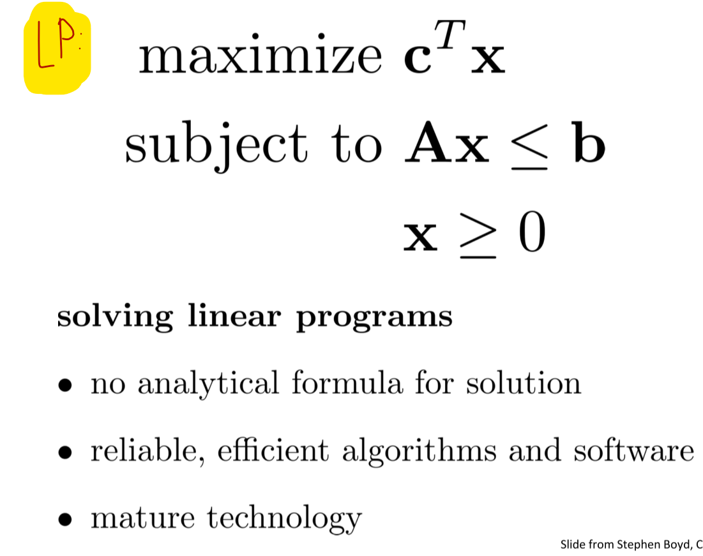
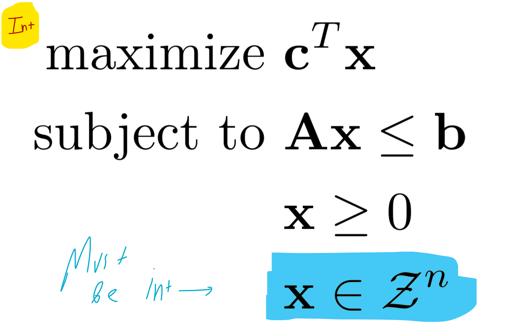
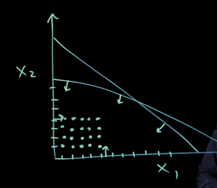
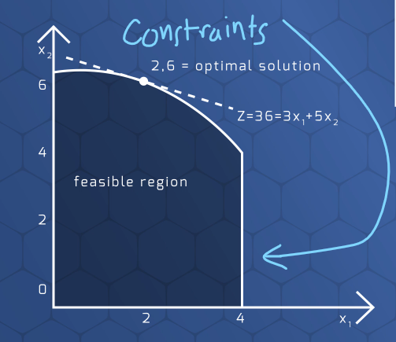
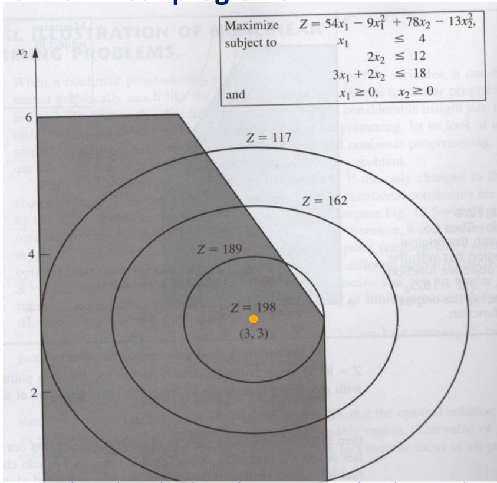
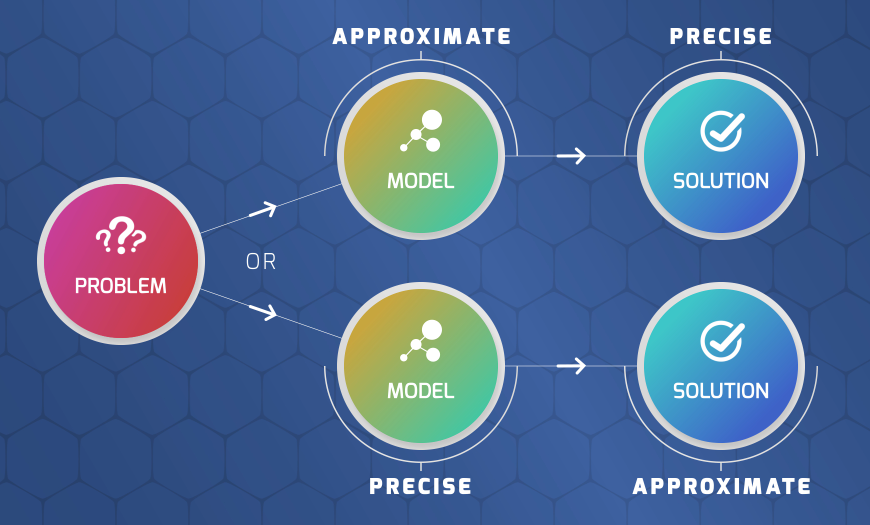
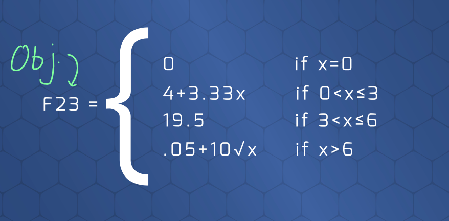
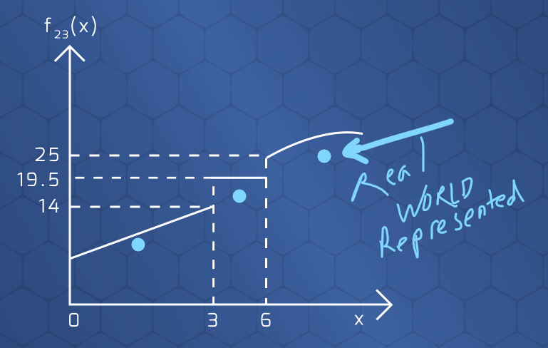
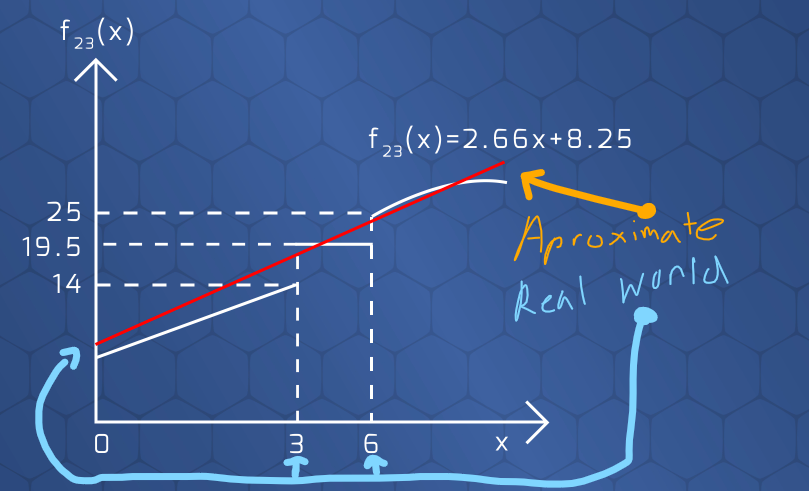

# Mathematical Optimization Overview

## Resources
* [Truth Table Calculator Tool](https://web.stanford.edu/class/cs103/tools/truth-table-tool/)

## Unit Objectives
1. Analyze logic problems using a mathematical model
2. Identify a variety of optimization problem types
3. Distinguish linear, integer, and non-linear programming problems
4. Differentiate between precise modeling and precise solutions as a problem-solving approach

---

 

## 1. `Logic Problems using a Mathematical Model`
* [Truth Table Calculator Tool](https://web.stanford.edu/class/cs103/tools/truth-table-tool/)

---

 

## 2. `Optimization Problem Types`

* Can have hard and soft constraints. Hard is a must, but soft is nice to have.

### Comparing Infeasible Models
> Model that satisfies that most constraints

* Maybe there is not a feasible solution space, but we want to know which model satisfies the most contraints
* Can compare with this type of modeling

---

 

## 3. `Linear, Integer, and Non-Linear Programming Problems`

### 3.1 - `Linear Programming`
* Optimal solution only exists at `corner points` (intersection of contraints), so very few possible optimal solutions
*   

 

### 3.2 - `Integer Programming`
* Must be an integer as solution
* Optimal may not be a corner point anymore (but in the feasible space), so calculating is *not efficient compared to LP*.
*   
*   

 

### 3.3 - `Non-Linear Programming`
> Optimal does not have to exist on a corner point

#### **Could be Non-Linear in `Constraints`**
*   

#### **Could be Non-Linear in `Objective Function`**

#### **Optimal Could be Inside Feasible Space**
* Not on Corner Point
*   

 

---

## 4. Problem-Solving Approaches: Precise *Modeling* vs. Precise *Solutions*
> Generally, `Approximate *solutions* to a precise *model* are better` than exact solutions to an approximate model.

 

### 4.1 - Overview of Precise Modeling vs. Precise Solutions

  

---

### 4.2 - Model `Setup` for Below Descriptions
* Objective Function for model setup below  
*   

### 4.3 - `Precise Modeling` resulting in *Approximate Solution* **`(BEST CASE)`**
* Precise `Modeling` yeilds an approximate solution, but it resembles to real world solution best  
* Solution will be *close to the actual solution*
* Takes *much less time to solve*
*   

### 4.4 - `Precise Solutions` via *Approximate Model*
* Approximate `Modeling` yields an precise solution, but it ***does not*** resemble real world solutions best  
* Example being Linear Regression. However, we could use linear algebra to solve this very quickly.
*   