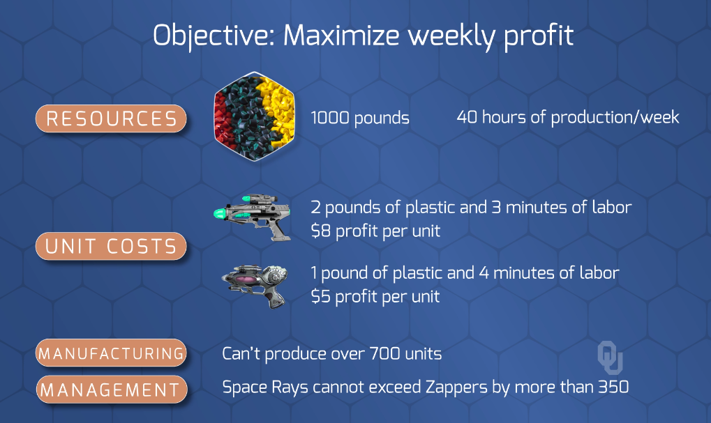

# Snapshot of Modeling

## Overview of Setup

 <br>

---

## Code to Model
```r
# Galaxy Industries Linear Programming Problem
reset;

# Set up options and the solver
option solver cplex;

# DECISION VARIABLES ---------------------------------------------

## Number of Space Ray Products
var SR >= 0;

## Number of Zapper Products
var Z >= 0;

# OBJECTIVE -----------------------------------------------------
maximize profit: (8*SR) + (5*Z);

# CONSTRAINTS -----------------------------------------------------
subject to plastic:    (2*SR) + (1*Z) <= 1000;
subject to labor:      (3*SR) + (4*Z) <= 2400;
subject to production:   (SR) +   (Z) <= 700;
subject to management:    (SR) -  (Z) <= 350;

# SOLVE ---------------------------------------------------------
solve;
```
---

## Run and View Output

### Get Objective
```r
ampl: model models\galaxyLP.txt;
```
```
CPLEX 20.1.0.0: optimal solution; objective 4360
2 dual simplex iterations (1 in phase I)
```

### Get Values of Decision Variables
```r
ampl: display SR, Z;
```
```
SR = 320
Z = 360
```