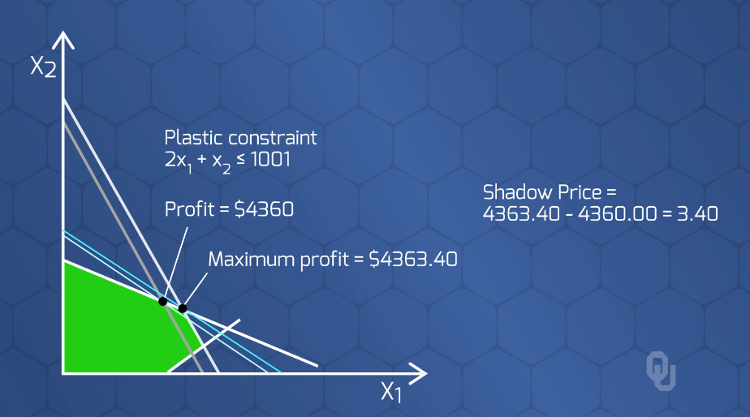

# Intro to Linear Programming (LP)

## Resources
* [See Linear Programming Example in `AMPL` here](https://github.com/Daniel-Carpenter/Metaheuristics/tree/main/02%20-%20Notes%20and%20Quizzes/03%20-%20Intro%20to%20LP/Example%20LP/AMPL%20Example)

## 1. Quick Notes Over Linear Programming

Solution Type   | Description   | Exanple
----------------|---------------|----------
`Infeasible`    | `Constraints` make it impossible to find an optimal solution          | Constraints make no feasible space
`Unbouded`      | Constraints do not actually constrain, so infinite solutions possible | Maximize profit, but did not put a limit on production capacity, so you can have unlimited produciton that results in infinite amounts of profit.

---
 

## 2. Sensitivity Analysis
> *'What if Analysis'*  
> How sensitive is the optimal solution when changing the input data (parameters) 

### 2.1 Questions to Answer:

Num | Question | Term
----|----------|------ 
1   |`How much will the optimal solution change` when altering on unit of the `RHS value of the Constraint`? | `Shadow Price`
2   | What is the `range of values for the input data` before the optimal solution changes?

### 2.2 Range of Optimal for `Objective Function` Example
  

### 2.3 Shadow Prices: Range of Optimal for `RHS Constraint Values`
* By increasing the RHS value of a constraint, how much does it change the optimal solution?
* This value only applies until you reach a value of another constraint
* If the optimal unit is *profit*, then it tells you that you should pay no more than the shadow price for the resource.  

