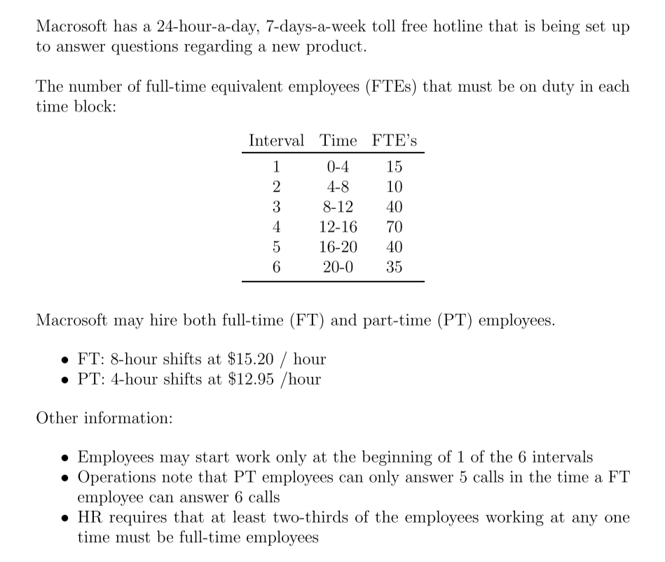
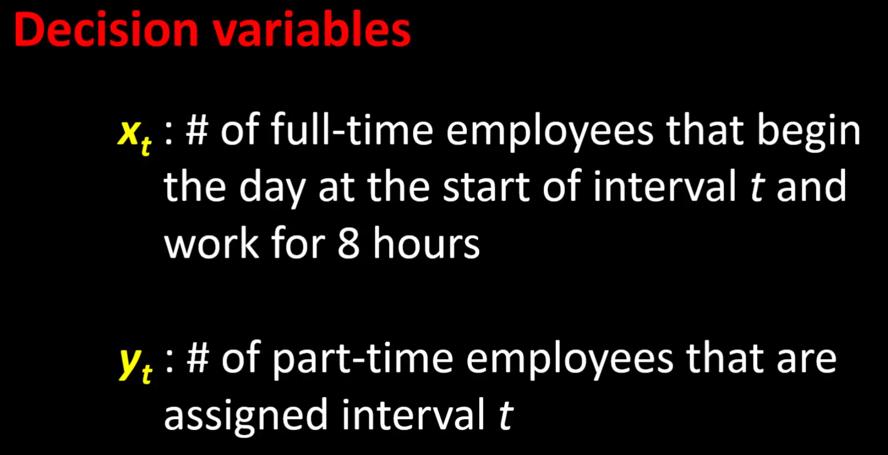
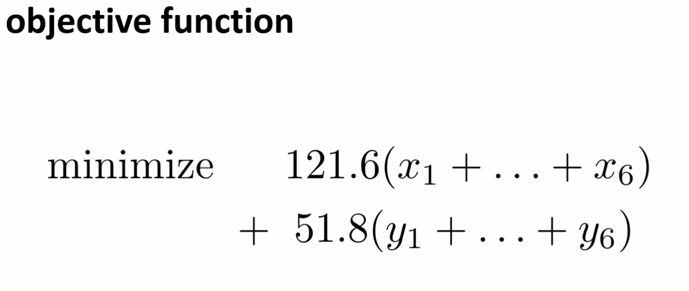
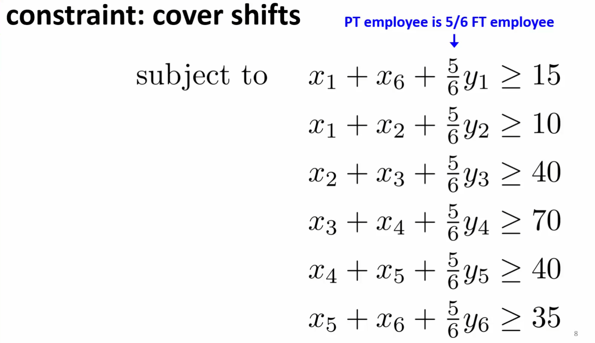
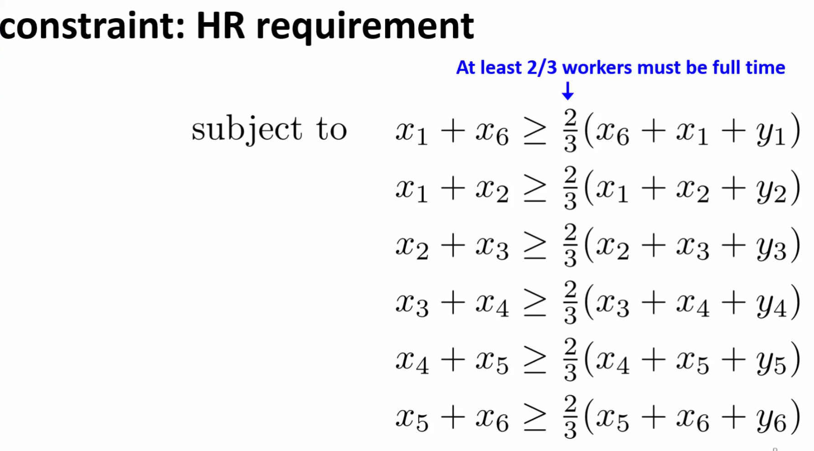
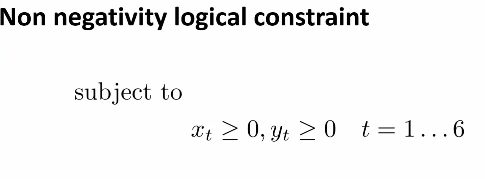

# Advanced Linear Programming (LP)
> Scheduling Optimization

## *Overview* of Problem
 <br>

## Mathetmatical Formulation

### `Decision Variables`
 <br>

### `Objective Function`
 <br>

### `Constraints`
 <br>
 <br>
 <br>

### `Parameters`
* *You would do this in a data file, but the instructor did not outline since each constraint containts relevant data*

---

## Code

### Data Inputs *`schedulingModel.dat`*
```py
#AMPL data for "Macrosoft" problem DSA/ISE 5113

data;

set T := 1 2 3 4 5 6;

param:   FTE :=
    1   15  
    2   10  
    3   40   
    4   70    
    5   40   
    6   35   ; 

param c_FT := 121.6;
param c_PT := 51.8;
param PT_FTE := 0.83333333333;
param HRfraq := 0.66666666667;
```

<br>

### Model *`schedulingModel.txt`*

```py
#AMPL code for the "Macrosoft" problem DSA/ISE 5113 

reset;

# OPTIONS ----------------------------------------

options solver cplex;


# PARAMETERS AND SETS ----------------------------

    set T circular;    #set of time periods

    param c_FT   >=0;  #cost of FT employee
    param c_PT   >=0;  #cost of PT employee

    param PT_FTE >=0;  #value of PT employee
    param HRfraq >=0;  #HR requirement of min percent of FT employees working

    param FTE{T} >=0;  #daily FTE requirements 


# DECISION VARIABLES ----------------------------

    var empFT{T} >=0 integer; #number of FT employees starting in each time period
    var empPT{T} >=0 integer; #number of PT employees starting in each time period


# OBJECTIVE --------------------------------------
    minimize cost: (c_FT*sum{t in T} empFT[t]) + (c_PT*sum{t in T} empPT[t]);


#CONSTRAINTS ------------------------------------
    subject to FTEreq {t in T}: empFT[t] + empFT[prev(t)] + PT_FTE*empPT[t] >= FTE[t];
    subject to HRreq  {t in T}: empFT[t] + empFT[prev(t)] >= HRfraq * (empFT[t] + empFT[prev(t)] + empPT[t]);


# LOAD DATA --------------------------------------
    data schedulingModel.dat;


# COMMANDS ---------------------------------------
    solve;

    print;
    print 'Number of Full-Time Employees to schedule:';
    display empFT;

    print 'Number of Part-Pime Employees to schedule:';
    display empPT;
```

<br>

> Output
```
CPLEX 20.1.0.0: optimal integer solution; objective 12795.2
11 MIP simplex iterations
0 branch-and-bound nodes

Number of Full-Time Employees to schedule:
empFT [*] :=
1  10
2   0
3  40
4  10
5  30
6   5
;

Number of Part-Pime Employees to schedule:
empPT [*] :=
1   0
2   0
3   0
4  24
5   0
6   0
;
```