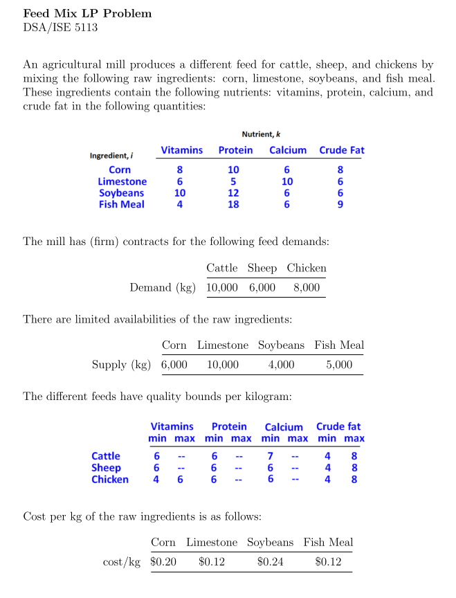
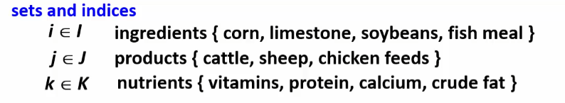
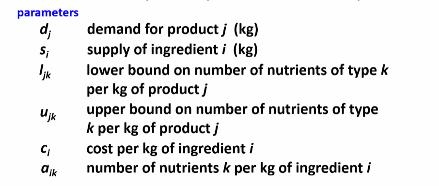
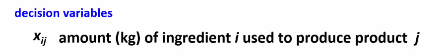
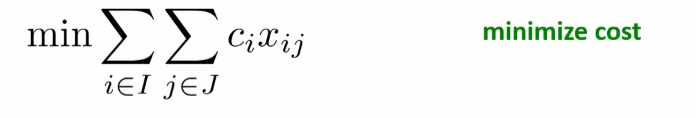
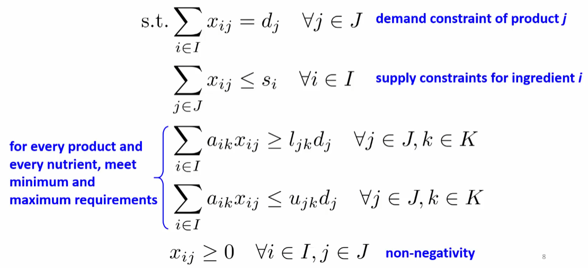

# Advanced Linear Programming (LP)
> Production Planning: Feed Mix Example

* Typical use of this model is for *blending* together `raw materials` and/or certain `qualities` to form a ***`commodity`*** 

## *Overview* of Problem
 <br>

---

## Mathetmatical Formulation

### `Sets`
 <br>

### `Parameters`
 <br>

### `Decision Variables`
 <br>

### `Objective Function`
 <br>

### `Constraints`
 <br>

---

## Code

### Data Inputs *`feedMix.dat`*
```py
#AMPL data file for the "Feed Mix" problem DSA/ISE 5113

data;

set I := corn limestone soybeans fishmeal;
set J := cattle sheep chicken;
set K := vitamins protein calcium fat;

#supply and cost of each ingredient
param:        s      c   :=
   corn       6000  .20
   limestone 10000  .12
   soybeans   4000  .24
   fishmeal   5000  .12;

#demand for the products
param  d := cattle 10000 
            sheep 6000 
            chicken 8000; 

#lower and upper bounds on nutrients
# dot <- use the default, which is infinity in the mod file
param:                l   u   := 
  [cattle,*]  vitamins 6   .  
              protein  6   . 
              calcium  7   .
              fat      4   8
  [sheep,*]   vitamins 6   .  
              protein  6   . 
              calcium  6   .
              fat      4   8
  [chicken,*] vitamins 4   6  
              protein  6   . 
              calcium  6   .
              fat      4   8;

param a:
            vitamins protein calcium fat :=
   corn        8       10      6      8
   limestone   6        5      10     6
   soybeans    10      12      6      6
   fishmeal    4       18      6      9;

```

<br>

### Model *`feedMix.txt`*

```py
#AMPL model for the "Feed Mix" problem DSA/ISE 5113

reset;

#options
options solver cplex;

#sets 
set I;   # ingredients 
set J;   # products 
set K;   # nutrients

#parameters
param d{J};     #demand for product j in J (kg)
param s{I};     #supply of ingredient i in I (kg)
param l{J,K};   #lower bound on nutrients k per product j (per kg)
param u{J,K} default Infinity;   #upper bound on nutrients k per product j (per kg)
param c{I};     #cost of ingredient i in I (per kg in cents)
param a{I,K};   #number of nutrients k per ingredient i (per kg)

#decision variables
var x{I,J} >= 0;  #amt of ingredient i used to produce product j

#data
data feedMix.dat; 

#objective
minimize cost: sum {i in I, j in J} x[i,j]*c[i];


#constraints

subject to demand {j in J}: 
   sum {i in I} x[i,j] = d[j];

subject to supply {i in I}: 
   sum {j in J} x[i,j] <= s[i];

subject to lowerB {j in J, k in K}: 
   sum {i in I} a[i,k]*x[i,j] >= l[j,k]*d[j];

subject to upperB {j in J, k in K}: 
   sum {i in I} a[i,k]*x[i,j] <= u[j,k]*d[j];

#commands

solve;
display x;


#some examples of how to print various output
#----------------------------------------------------


#using the display commands (and constraint functions)

display {j in J}: sum {i in I} x[i,j];   #display the sum ingredients for each product

display {i in I}: sum {j in J} x[i,j], s[i];   #display sum of product for each ingredient, and supply of ingredients


#display the upper/lower bounds, and actually used amounts of ingredients 
#for every product/nutrient combination

display {j in J, k in K}: l[j,k]*d[j],  sum {i in I} a[i,k]*x[i,j], u[j,k]*d[j];


#----------------------------------------------------
#the "display" command can get kind of ugly, so you can improve on it 
#using the printf commands

printf {j in J}: "%10s --> Demand: %d  Production: %6.2f \n", j, d[j], sum{i in I} x[i,j];  


#----------------------------------------------------
#or even more informative...


# show how the demand was met by the production solution
printf "\n\nDemand was met by the production solution (kg)\n";
print "-----------------------------------------";
for {j in J} {
  printf "Product: %s   Demand: %d \n Production:\n", j, d[j]; 
  for {i in I} {
     printf "     Ingredient: %9s %6.2f\n", i, x[i,j];  
 }
  printf "\n"; 
}


#show the supply used
printf "\n\nIngredients supply usage (kg)\n";
print "-----------------------------------------";
for {i in I} {
  printf "Ingredient: %s \n (Supply: %8.2f; Total used: %8.2f) \n  Production:\n", i, s[i], sum{j in J} x[i,j]; 
  for {j in J} {
     printf "     Product: %9s %6.2f\n", j, x[i,j];  
 }
}
```

<br>

> Output
```
CPLEX 20.1.0.0: optimal solution; objective 3720
6 dual simplex iterations (0 in phase I)
x :=
corn      cattle     115.385
corn      chicken      0
corn      sheep     5884.62
fishmeal  cattle    4384.62
fishmeal  chicken    615.385
fishmeal  sheep        0
limestone cattle    2500
limestone chicken   7384.62
limestone sheep      115.385
soybeans  cattle    3000
soybeans  chicken      0
soybeans  sheep        0
;

sum{i in I} x[i,'cattle'] = 10000

sum{i in I} x[i,'sheep'] = 6000

sum{i in I} x[i,'chicken'] = 8000

sum{j in J} x['corn',j] = 6000
s['corn'] = 6000

sum{j in J} x['limestone',j] = 10000
s['limestone'] = 10000

sum{j in J} x['soybeans',j] = 3000
s['soybeans'] = 4000

sum{j in J} x['fishmeal',j] = 5000
s['fishmeal'] = 5000

l['cattle','vitamins']*d['cattle'] = 60000
sum{i in I} a[i,'vitamins']*x[i,'cattle'] = 63461.5
u['cattle','vitamins']*d['cattle'] = Infinity

l['cattle','protein']*d['cattle'] = 60000
sum{i in I} a[i,'protein']*x[i,'cattle'] = 128577
u['cattle','protein']*d['cattle'] = Infinity

l['cattle','calcium']*d['cattle'] = 70000
sum{i in I} a[i,'calcium']*x[i,'cattle'] = 70000
u['cattle','calcium']*d['cattle'] = Infinity

l['cattle','fat']*d['cattle'] = 40000
sum{i in I} a[i,'fat']*x[i,'cattle'] = 73384.6
u['cattle','fat']*d['cattle'] = 80000

l['sheep','vitamins']*d['sheep'] = 36000
sum{i in I} a[i,'vitamins']*x[i,'sheep'] = 47769.2
u['sheep','vitamins']*d['sheep'] = Infinity

l['sheep','protein']*d['sheep'] = 36000
sum{i in I} a[i,'protein']*x[i,'sheep'] = 59423.1
u['sheep','protein']*d['sheep'] = Infinity

l['sheep','calcium']*d['sheep'] = 36000
sum{i in I} a[i,'calcium']*x[i,'sheep'] = 36461.5
u['sheep','calcium']*d['sheep'] = Infinity

l['sheep','fat']*d['sheep'] = 24000
sum{i in I} a[i,'fat']*x[i,'sheep'] = 47769.2
u['sheep','fat']*d['sheep'] = 48000

l['chicken','vitamins']*d['chicken'] = 32000
sum{i in I} a[i,'vitamins']*x[i,'chicken'] = 46769.2
u['chicken','vitamins']*d['chicken'] = 48000

l['chicken','protein']*d['chicken'] = 48000
sum{i in I} a[i,'protein']*x[i,'chicken'] = 48000
u['chicken','protein']*d['chicken'] = Infinity

l['chicken','calcium']*d['chicken'] = 48000
sum{i in I} a[i,'calcium']*x[i,'chicken'] = 77538.5
u['chicken','calcium']*d['chicken'] = Infinity

l['chicken','fat']*d['chicken'] = 32000
sum{i in I} a[i,'fat']*x[i,'chicken'] = 49846.2
u['chicken','fat']*d['chicken'] = 64000

    cattle --> Demand: 10000  Production: 10000.00 
     sheep --> Demand: 6000  Production: 6000.00 
   chicken --> Demand: 8000  Production: 8000.00 


Demand was met by the production solution (kg)
-----------------------------------------
Product: cattle   Demand: 10000 
 Production:
     Ingredient:      corn 115.38
     Ingredient: limestone 2500.00
     Ingredient:  soybeans 3000.00
     Ingredient:  fishmeal 4384.62

Product: sheep   Demand: 6000 
 Production:
     Ingredient:      corn 5884.62
     Ingredient: limestone 115.38
     Ingredient:  soybeans   0.00
     Ingredient:  fishmeal   0.00

Product: chicken   Demand: 8000 
 Production:
     Ingredient:      corn   0.00
     Ingredient: limestone 7384.62
     Ingredient:  soybeans   0.00
     Ingredient:  fishmeal 615.38


Ingredients supply usage (kg)
-----------------------------------------
Ingredient: corn 
 (Supply:  6000.00; Total used:  6000.00) 
  Production:
     Product:    cattle 115.38
     Product:     sheep 5884.62
     Product:   chicken   0.00
Ingredient: limestone 
 (Supply: 10000.00; Total used: 10000.00) 
  Production:
     Product:    cattle 2500.00
     Product:     sheep 115.38
     Product:   chicken 7384.62
Ingredient: soybeans 
 (Supply:  4000.00; Total used:  3000.00) 
  Production:
     Product:    cattle 3000.00
     Product:     sheep   0.00
     Product:   chicken   0.00
Ingredient: fishmeal 
 (Supply:  5000.00; Total used:  5000.00) 
  Production:
     Product:    cattle 4384.62
     Product:     sheep   0.00
     Product:   chicken 615.38
```