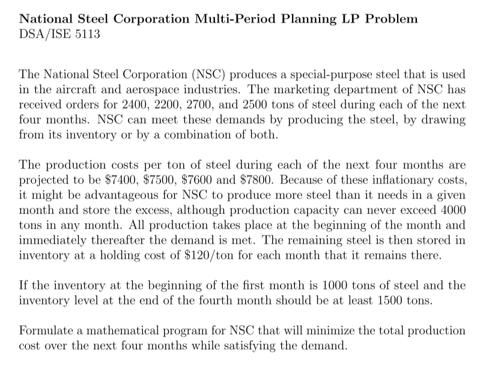
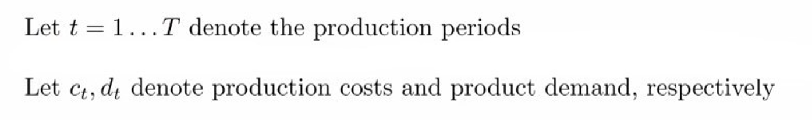
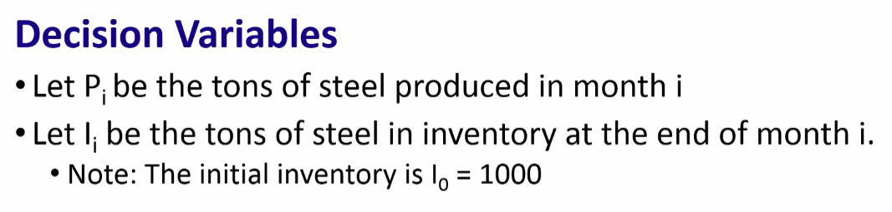
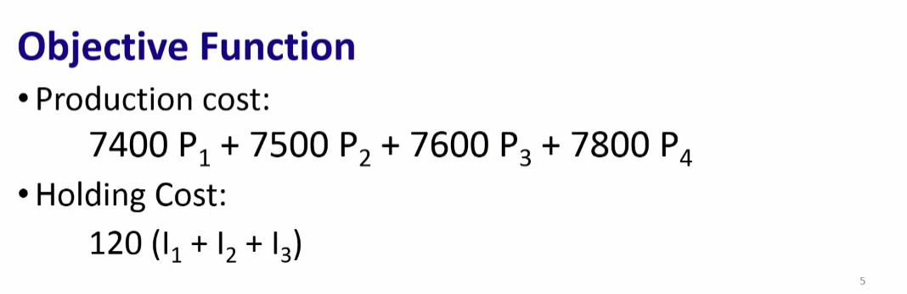
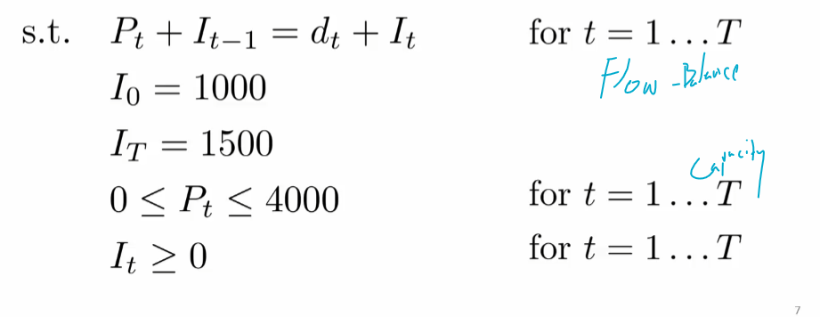

# Advanced Linear Programming (LP)
> Production Planning: Feed Mix Example

* Typical use of this model is for *blending* together `raw materials` and/or certain `qualities` to form a ***`commodity`*** 

## *Overview* of Problem
 <br>

---

## Mathetmatical Formulation

### `Sets`
 <br>

### `Parameters`
 <br>

### `Decision Variables`
 <br>

### `Objective Function`
 <br>

### `Constraints`
 <br>

---

## Code

### Data Inputs
```py

```

<br>

### Model

```py

```

<br>

> Output
```

```
