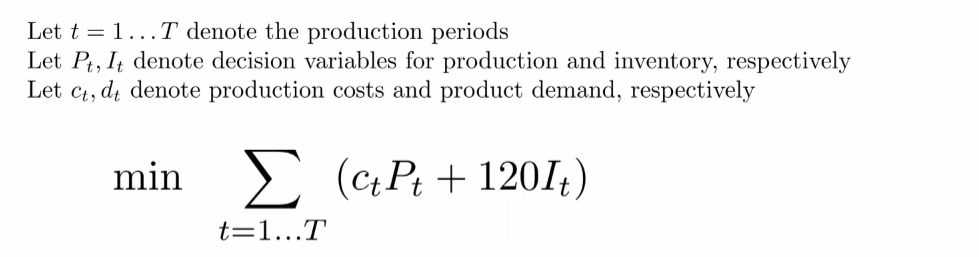

# Advanced Linear Programming (LP)
> Multiperiod Planning

* Typical use of this model is for production companies that are able to hold inventory and expect higher prices in future periods
* Note additional models (not included in this readme have multi-commodity)

## *Overview* of Problem
 <br>
 <br>
 <br>
* Whatever goes in must go out, but could store it

---

## Mathetmatical Formulation

<!-- ### `Sets`
 <br> -->

### `Parameters`
* Inventory holding costs per unit per month  
 <br>

### `Decision Variables`
 <br>

### `Objective Function`
 <br>
 <br>

### `Constraints`
* `Flow balance constraint` = allows us to produce more earlier and store it for later demand (because it could be cheaper, like this case) 
 <br>

---

## Code

### Data Inputs *`nsc.dat`*
```py
param MONTHS := 4;
param ic := 120;

param c := 
1 7400  
2 7500  
3 7600  
4 7800;

param d :=
1 2400  
2 2200  
3 2700  
4 2500  ;
```

<br>

### Model *`nsc.txt`*

```py
reset;
option solver cplex;


param MONTHS;   # Number of months in the planning horizon
param ic;  	# inventory holding cost per unit per month

param c {1 .. MONTHS};  # c[i] = cost of producing one ton in month i
param d {1 .. MONTHS};  # d[i] = tons of product needed in month i

#DECISION VARIABLES
var P {1 .. MONTHS} >= 0, <= 4000;   # P[i] = tons produced in month i

var I {0 .. MONTHS} >= 0;   # I[i] = tons in inventory at the end of month i

data nsc.dat;

#OBJECTIVE
minimize cost: 
sum{i in 1 .. MONTHS} (c[i]*P[i] + ic*I[i]);

subject to inventory {i in 1 .. MONTHS}: P[i] + I[i-1] = I[i] + d[i];

subject to initial_inventory: I[0] = 1000;
subject to final_inventory: I[MONTHS] = 1500;


solve;
display cost;

#nice little way for printing the non-zero solution values
for {i in 1..MONTHS} {
  if I[i] > 0 then printf "I[%d] = %d  cost = %d \n", i,I[i], ic*I[i];
  if P[i] > 0 then printf "P[%d] = %d  cost = %d \n", i,P[i], c[i]*P[i];
}

```

<br>

> Output
```
CPLEX 20.1.0.0: optimal solution; objective 78512000
2 dual simplex iterations (0 in phase I)
cost = 78512000

I[1] = 900  cost = 108000 
P[1] = 2300  cost = 17020000 
I[2] = 2700  cost = 324000 
P[2] = 4000  cost = 30000000 
I[3] = 4000  cost = 480000 
P[3] = 4000  cost = 30400000 
I[4] = 1500  cost = 180000 
```
