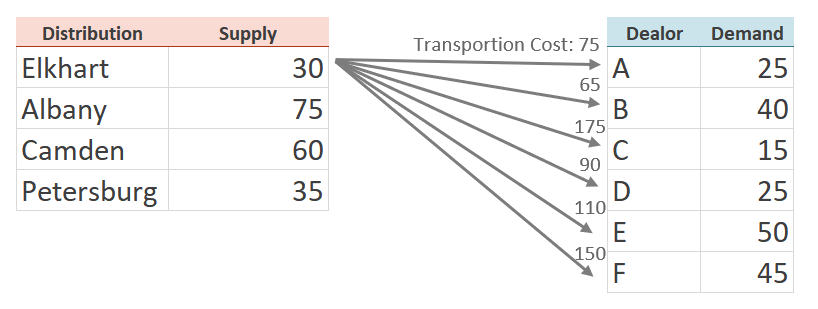
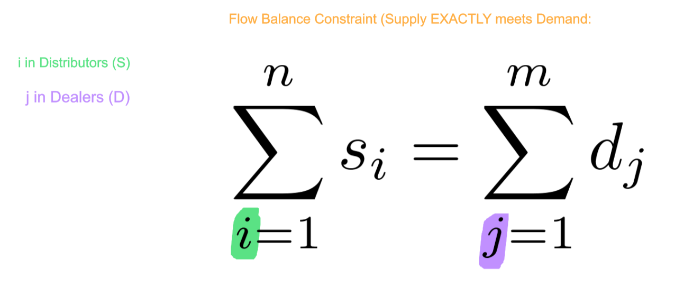

# Advanced Linear Programming (LP)
> Transportation Problem 

* Typical use of this model is for `Supply` and `Demand`. 
* Other application: `Assignment` problem (*assigning to time slots, tasks, positions, programs*). See Slides for problem overview

## *Overview* of Problem
 <br>

* For example, the `transportation cost` from `Elkhart` to the `Dealors`
 <br>

---

## Mathetmatical Formulation

### `Sets`
 <br>

### `Parameters`
 <br>

### `Decision Variables`
 <br>

### `Objective Function`
 <br>

### `Constraints`
 <br>
 <br>

---

## Code

### Data Inputs *`trans.dat`*
```py
data;

set ORIG := IN NY NJ VA;  
set DEST  := A B C D E F;

param supply :=  IN 30    NY 75   NJ 60   VA 35;

param demand :=  A 25   B 40  C 15  D 25  E 50  F 45;

param cost        : A   B   C   D   E   F := 
IN 75  65 175  90 110 150                  
NY 90  30  45  50 105 130 
NJ 40  55  35  80  70  75
VA 95 150 100 115  55  55;
```

<br>

### Model *`trans.txt`*

```py
#AMPL code for the transportation problem

reset;
options solver cplex;

#sets and parameters

set ORIG;   # origins
set DEST;   # destinations

param supply {ORIG} >= 0;   # amounts available at origins
param demand {DEST} >= 0;   # amounts required at destinations

   check: sum {i in ORIG} supply[i] = sum {j in DEST} demand[j];

param cost {ORIG,DEST} >= 0;   # shipment costs per unit


#decision variables

var x {ORIG,DEST} >= 0;    # units to be shipped


#objective

minimize Total_Cost:
   sum {i in ORIG, j in DEST} cost[i,j] * x[i,j];


#constraints

subject to Supply {i in ORIG}:
   sum {j in DEST} x[i,j] = supply[i];

subject to Demand {j in DEST}:
   sum {i in ORIG} x[i,j] = demand[j];


#data

data trans.dat;


#commands 

solve;
display x;
```

<br>

> Output
```
CPLEX 20.1.0.0: optimal solution; objective 11325
5 dual simplex iterations (0 in phase I)
x [*,*] (tr)
:   IN   NJ   NY   VA    :=
A   25    0    0    0
B    0    0   40    0
C    0    5   10    0
D    0    0   25    0
E    5   45    0    0
F    0   10    0   35
;
```
