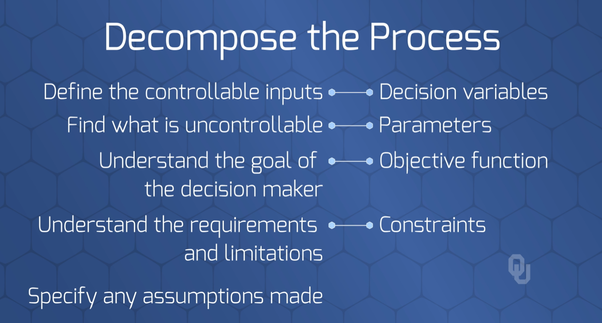

# Advanced Linear Programming (LP)
> *The final test of a theory is to test it on the problem that originated it*

## Resources

## Table of Contents
1. Recognize and differentiate decisions, objectives, and constraints in optimization problems
2. Recognize blending, multi-period planning, transportation, and assignment problems
3. Separate problem types from problem instances
4. Write AMPL code for model files and for data files separately

---
 

## 1. Recognize and differentiate `decisions`, `objectives`, and `constraints` in optimization problems

---
 

## 2. Recognize blending, multi-period planning, transportation, and assignment problems

### `Scheduling` Problem

---
 

---
 

## 3. Separate problem types from problem instances

---
 

## 4. Write AMPL code for model files and for data files separately

