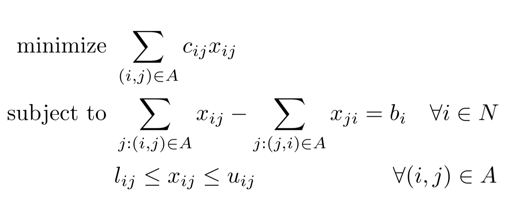

# Network Flow Modeling
> Shortest Path `via Minimum Cost Flow`  
> *SEE SLIDES FOR FULL OVERVIEW*
* Travel costs, shortest distance between two paths

---

## Shortest Path General Overview
 <br>
 <br>
 <br>


## *Overview* of Example Problem
## *Overview* of Problem
 <br>
 <br>

## Mathetmatical Formulation
 <br>
 <br>

## Optimal Solution
 <br>

## Code

### Data Inputs *`data.dat`*
```py
#Shortest Path MCNFP Problem Formulation - data file for shortest path problem instance in lecture "Farm Distance"
#Charles Nicholson, ISE 5113

#use with MCNFP.txt model
#note: default arc costs and lower bounds are 0
#      default arc upper bounds are infinity
#      default node requirements are 0


set NODES :=  	1 2 3 4 5 6;

set ARCS := 	(1,2) (1,3) (2,3) (2,4) (2,5) (3,4) (3,5) (4,5) (4,6) (5,6);

param b:=	1  1     #for shortest path problem, start node supply = 1
        	6 -1;    #and the destination node supply = -1

#note: to make things a little more compact, you can use a "template" 
# for setting up costs.  See Chapter 9 "Specificying Data" in the AMPL textbook 

#for example, the first line below: [1, *] 2 5   3 10    
#is short hand for: [1, 2] 5   [1,3]  10   

#this comes in handy for some larger, more complex data files.

param c:=	[1, *] 2 8   3 10  		#arc cost equals the distance
                [2, *] 3 4   4 9    5 5 
                [3, *] 4 6   5 2  
                [4, *] 5 3   6 4 
                [5, *] 6 5;
```

<br>

### Model *`model.txt`*

```py
# AMPL model for the Minimum Cost Network Flow Problem
#
# By default, this model assumes that b[i] = 0, c[i,j] = 0,
# l[i,j] = 0 and u[i,j] = Infinity.
#
# Parameters not specified in the data file will get their default values.

options solver cplex;

set NODES;                        # nodes in the network
set ARCS within {NODES, NODES};   # arcs in the network 

param b {NODES} default 0;        # supply/demand for node i
param c {ARCS}  default 0;        # cost of one of flow on arc(i,j)
param l {ARCS}  default 0;        # lower bound on flow on arc(i,j)
param u {ARCS}  default Infinity; # upper bound on flow on arc(i,j)

var x {ARCS};                     # flow on arc (i,j)
 
minimize cost: sum{(i,j) in ARCS} c[i,j] * x[i,j];  #objective: minimize arc flow cost

# Flow Out(i) - Flow In(i) = b(i)

subject to flow_balance {i in NODES}:
sum{j in NODES: (i,j) in ARCS} x[i,j] - sum{j in NODES: (j,i) in ARCS} x[j,i] = b[i];

subject to capacity {(i,j) in ARCS}: l[i,j] <= x[i,j] <= u[i,j];
```

<br>

<!-- > Output
```
``` -->
