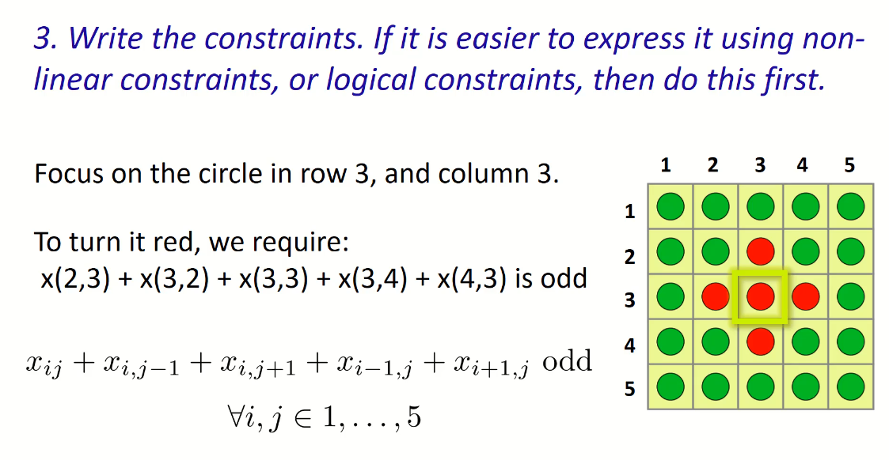

# Integer Programming Modeling Examples

## Using Integer Programming and Binary Vars.
Model | Description
-|-
Choose `Facility Location` | Among a few potential options, choose the best placement
`Clothing Produciton` | Produce Clothing while Renting Machinary 
`Game of Fiver` | Solve the game called Fiver
`Suduko` | Solve the Puzzle

## `Sudoku` Example
  

## `Fiver` Example
  
  
  
  
  
  
  

 
 
 
 
 
 
 
 
 
 
 
 
 
 
 
 
 

 