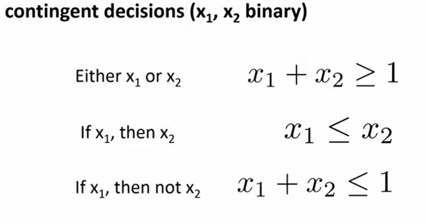
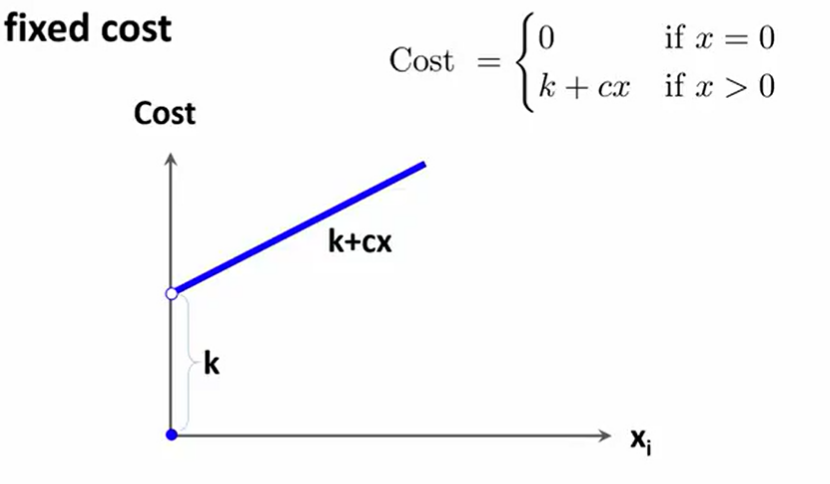
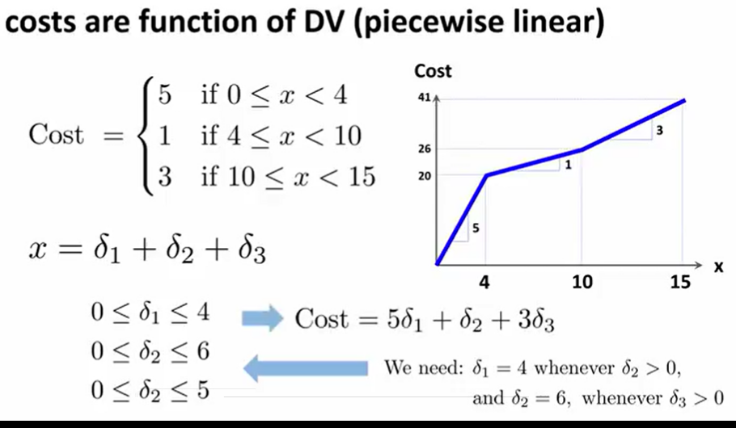
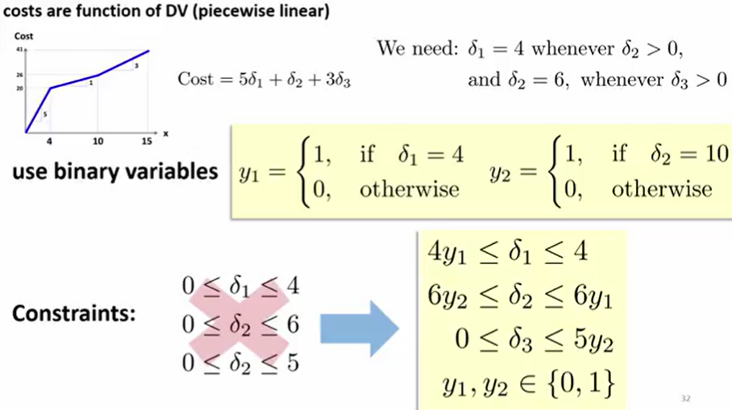
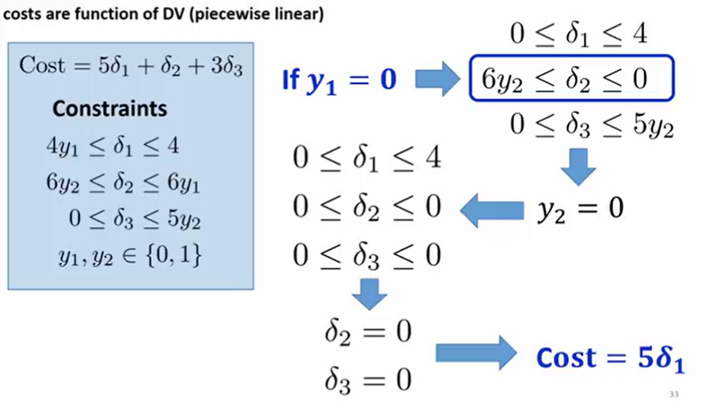
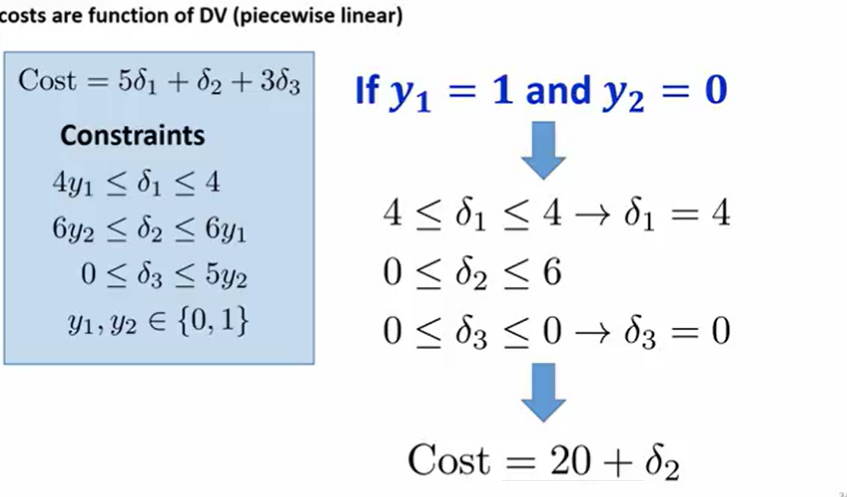

# Integer Programming
> 

## Overview

### General Overview
* More complex
* Medium or Large size could take a long time
* Cannot do sensativity analysis!
* Small problems are usually fine
* Min Cost Flow Network Problem naturally Integer
* Can round to the nearest integer for an LP problem with large siginificant digits. DOn't do this for small number problems like choose 1 or 2 cars.

### Examples of Integer Programs
* Capital budgeting
* Facility Location
* Warehouse Location
* Sequencing

### Some Problems can only be formed as Integer Problems
* Yes/No Decisions (Investments, etc)
* Continguint Decisions (if x, then y)
* Disjunctive (Either/Or)
* Restrictive set or range of decision variables (x = 0, or x > 15)
* Fixed Costs
* Piecewise linear cors (economies of scale)

---

## Yes/No Decisions
> W=Deciside to engage in something or not

### Example:
Select only one of the following:
1. To build a new plant
2. Take an advertising campaign, or
3. DEvelope a new product

#### Decision Variables
Sum of the decision variables (the three above) must be 1

#### Restrictions (Constraints)
* Select at least one option (k of n)
* Select at most some options (k of n)
* Select exactly one options (k of n)

Examples of how to model the constraints:
  

---

## Either/Or
> Satify either one constraint or the other

### Overview
* Uses Big M algorithm
* Introduce a new binary variable that has says which constraint is activated

---

## Restricted Set or Values
> Decision variable can only be in a certain set of discrete values

* Add a binary variable that will activate a specific constraint
* E.g. `x` can be either `0` or `>= 15`

## Fixed Costs
> If you do not do it, then 0, if so, then fixed cost plus linear model

  

## Piecewise Linear Costs
> Various marginal costs as you increase `x`  
> Only use when minimizing for economies of scale OR maximizing diseconomies of scale

  
  
  
  

<!--    -->