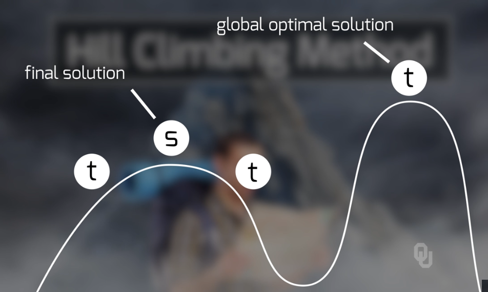
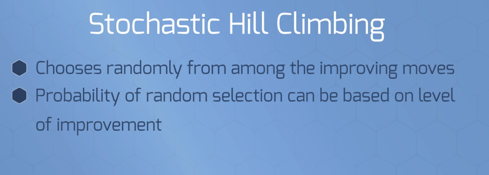

# `Heuristics` Intro & `Local Search`

## Table of Contents
* Explain the differences between `exact`, `approximate`, and `heuristic methods`
* Encode solutions for heuristics
* Develop `neighborhoods` for `local search` techniques
* Develop `evaluation functions` for heuristics
* Solve problems using:
    * `hill climbing`, 
    * hill climbing with `random restarts`, 
    * hill climbing with `random walk`, 
    * local `beam search`, and 
    * `stochastic beam search`

---
 

## Overview of Optimization Techniques

Key Question | Answer
-------------|--------
What are `exact` methods? | Can find an exact optimal, like `simplex` or `Least-squares`, `branch-and-bound`, `complete enumeration`
What are `approximate` methods? | Do not gaurentee optimal, but give a bound for the optimal.
What are `metaheuristics`? | Subset of heuristics that are highly-generalizable. 
Explain the differences between `exact`, `approximate`, and `heuristic methods` | Hueristics are much faster but could give a non-optimal solution. 

---
 

# `Heuristic` Methods

## `Heuristics` Overview

### What are `heuristic` methods?
* Give an approximate solution to an EXACT model *(if model well formulated)*
* Do not gaurentee optimal
* DOES NOT give a range of potential solutions.
* They do well in practice. 

### What are `metaheuristics`? 
* Subset of heuristics that are highly-generalizable. 
 

### Types of Heuristics:
Num | Method Name | Explanation
----|-------------|--------------
1   | `generate and test`       | Guessing
2   | `gradient descent`        | Require differentiable objective
3   | `decomposition methods`   | Break down into sub problems then recombine to the oberall
4   | `reduction techniques`    | reduce the size of the solution space. Could remove the optimal
5   | `constructive heuristics` | Build solution from scratch
6   | `improving heuristics`    | Find an initial solution then improve it. Most techniques in the class are improving

### Potential problems with `heuristics`
* Could accidentally find local maximums or minimums
  

---
 

## Important Terminology related to `heuristics`

### Important Terminology related to `heuristics`
  
  

### Changes in Terminology from Exact to `Heuristic` Methods
Old Term | New Term | Description
---------|----------|-------------
Decision    | `Decision encoding` | like valid ineqalities in the sense that you can realize that there are certain spaces that the solution cannot exist in.
Objective   | `Evaluation function`
COnstraints | Same |Still have constraints, need to figure out to handle them though

---
 

## Developing `Evalutation Functions`

### What are `Neighborhoods`?
* Grouping of potential solutions that are `near a the actual solution`
* It can be said to be an art to define the neighborhood
* Can measure from the point by using:
    1. Euclidean Distance
    2. Hamming Distance
    3. Jaccard Distance
    4. Mahalanobis Distance

  
  

### What is the `Evaluation Fuction`?
* Use the original objective and see if it is feasible. 
* Important to define this function well since each move is based on the evaluation function 
  

---
 

## `Hill Climbing` Overview
> * Very efficient technique  
> * Iteratively climb up a hill  
> * Analogous to climbing a mountain with no map and in dense fog  
> ***Main problem with method is falling in a `local max/min`***

### Why is Hill Climbing a **greedy** technique?
* Could have many bad moves that increase time of the search
* ***Only based on the `local hill`***
* Has no memory of where it has been

### **Pros and Cons** to Hill Climbing
  

### Important Questions to Answer related to Hill Climbing
  

#### 1. False Solution to if no solutions are better
  

#### 2. Treats each equal solution as indifferently

---
 

## `Hill Climbing` Methods

### `Steepest Ascent` Hill Climbing
> Ends once it finds the best local neighbor  

  

### `First Accept` Hill Climbing
> Ends once it finds the first better neighbor  

  

---
 

## Improving upon Hill Climbing

### Hill Climbing with `random walk`
* Allows to search the entire space (through random walk) 
* Overcomes local max/min
  

### `Stochastic` Hill Climbing
  

### ***`Best Method`***: Hill Climbing with `random restart`
  

### Local `Beam Search`
* Simultaniously search multiple neighborhoods and iterate to around the best
* *Disadvantage*: Usually converges quickly which ends up being resource intensive and has little benefit

  

### `Stochastic Beam Search`
* Overcomes local beam search disadvantages
* Assigns higher probability to potentially better solutions 
  

## Metaheuristics

### What are Metaheuristics
> Goal to overcome issue with local min/max  

  

### Examples of Metaheuritics
> Many metaheuristics out there. Be careful as some are not good.  

  
  