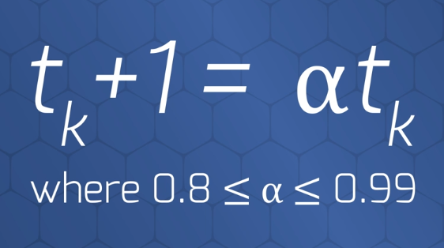
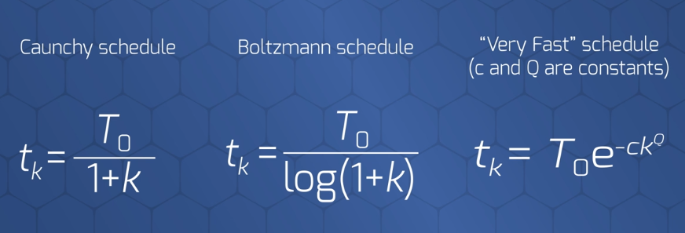
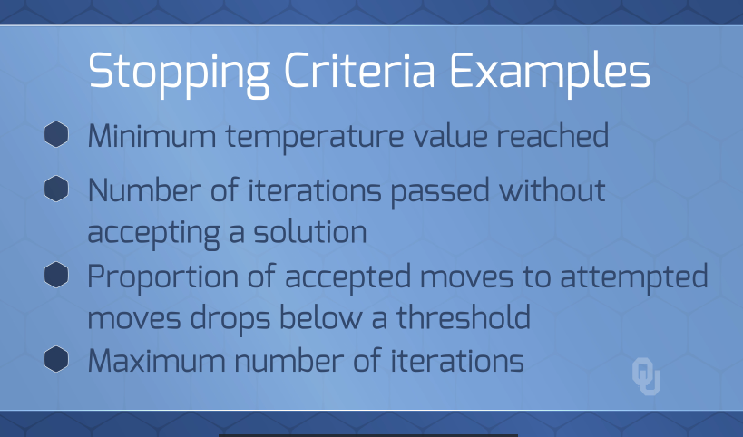

# Simulated Annealing
> Escape local minima by making *controlled bad moves*.  
> As the algorithm continues to makes moves, *gradually make less frequent bad moves*

---
 

## SA vs. Hill Climbing
* Hill climbing makes the best move always
* Simulated Annealing makes the bad moves sometimes

---
 

## SA Conceptual Process
1. Instead of choosing best move, choose a random move
2. Acceptance Options  
    i. `If the move is BETTER` than the current solution, `Accept`  
    ii. `If the move is WORSE` than the current solution, `Accept with probability p`

### Controlling Bad Moves: Less bad as iterations increase:
  
  
*`T` is the temperature. Decrease the temperature on a schedule dependant on increased iterations*  
*Above assumes minimization. Change to `f(s[2]) - f(s[1])` for **max**, since current solution needs to be more.*     
  
  

---
 

## SA Algorithm - Conceptual Details

### Conceptual Algorithm
  

 

### Pseudo-Code
  
  

---
 

## The Terminology: SA analogous to Thermodynamics
  
  
***Above is the formula within `thermodynamics`. Do not use for SA!***

---
 
 

# Practical Implentation of SA - Overview  
> Most methods below are subjective, but that is common in metaheuristics  

1 - How to set the initial Temperature `T`?  
2 - How to Set the Cooling Schedule?  
3 - How Long Should be spent at each Temperature `M[k]`  
4 - When do you stop the cooling schedule?  

---
 

## Oveview of Implenting SA

### `Adapative` vs. `Static` Approach:
1. Could Have a static, predefined schedule
2. Adapaptive

### Conceptual Approach to `Cooling Schedules`:
1. Do you want ***high*** number of iterations `k` at each temperature, with ***fewer*** temperatures `M[k]`
1. Do you want ***low*** number of iterations `k` at each temperature, with ***more*** temperatures `M[k]`

---
 

## 1 - How to `Set the initial Temperature` `T`?
> Set to high value (subjective)

### Ways to Set Initial Temperature:
1. Make the first solutions very random so that the last solution is independent of the starting one
2. Heating Algorithm: % of accepted moves relative to total moves reaches a set ratio

---
 

## 2 - How to `Set the Cooling Schedule`?

### Algorithm Options for Cooling Schedules:
1.  <- (*Most Common*) 
1.   

---
 

## 3 - How Long should be Spent at Each Temperature `M[k]`
> Should depend on the size of the neighborhood and solution space  

### Possible Approaches
1. Generally increase `M[k]` as the temperature `T` decreases
2. Accept a certain number of moves before moving to next temperature `T`

---
 

## 4 - When to `Stop the Procedure`
> Highly subjective - depends on your data  

  

