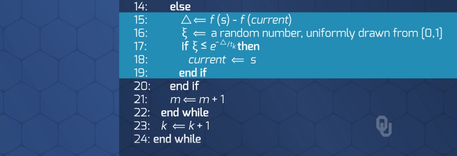
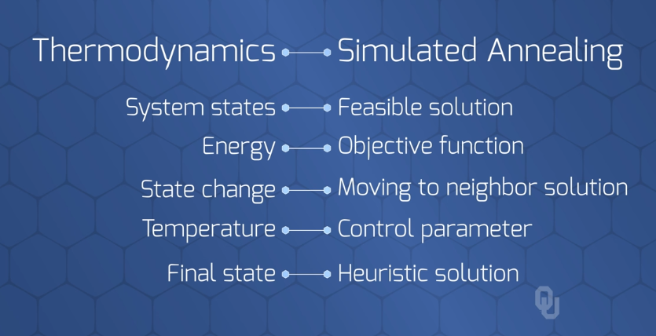

# Simulated Annealing
> Escape local minima by making *controlled bad moves*.  
> As the algorithm continues to makes moves, *gradually make less frequent bad moves*

---
 

## SA vs. Hill Climbing
* Hill climbing makes the best move always
* Simulated Annealing makes the bad moves sometimes

---
 

## SA Conceptual Process
1. Instead of choosing best move, choose a random move
2. Acceptance Options
    i. `If the move is BETTER` than the current solution, `Accept`
    ii. `If the move is WORSE` than the current solution, `Accept with probability p`

### Controlling Bad Moves: Less bad as iterations increase:
  
  
  
  

---
 

## SA Algorithm - Conceptual Details

### Conceptual Algorithm
  

 

### Pseudo-Code
  
  

---
 

## The Terminology: SA analogous to Thermodynamics
  
  
