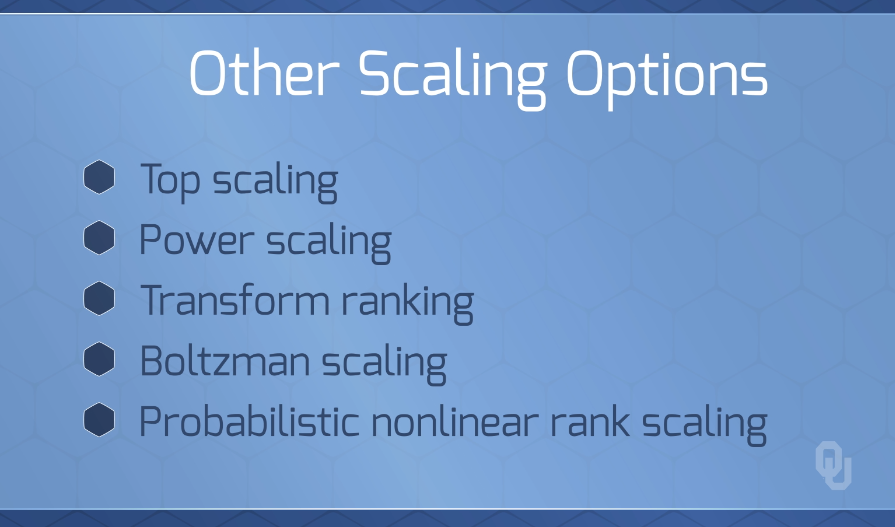

# Genetic Algorithm
> Use's Darwin's idea of survival of the fittest to obtain the best solution

 

## GA `Goals`
1. Design artifical software that retains natural environment that we try to emulate  
2. Better understand how natural environment evolves  

---
 

## GA `Benefits` and `Uses`
  
  

---
 

## GA `Process` Overview
> Iteratively, randomly, but intelligently search population, while using many simulanious solutions per iteration  

### `Repeat the Following Process Many Times` until Highly Improved Solutions
1. *`Start with random population`* of solutions  
      
2. *`Combine best solutions`*, producing better solutions (hopefully)  
      
3. *`Mutation:`* small % of the combined solutions are *modified*  
      
    * Changes can *improve* or *reduce* the solution's quality  

---
 

## GA `Terminology`
  
  

---
 
 

# GA Process Details

## GA Detailed Process - `Overview`
> Overall goal is to slighly evolve parents to enhance diversity of offspring while resembling the parents.   
> Accomplished through survival of the fittest methods

### High-Level Steps
1. Create a Random Population size `n`  
2. Randomly compare population fitness  
3. Create a new Population  
4. Rerun the algorithm with the new population  
5. Return best solution of the current population  
6. Loop back to step 2 and evaluate the fitness  

---
 

## GA Detailed Process - `Steps`

  

### 1. Create a Random Population (`n` depends on specific problem)  
* `n` Chromosomes (usually n-bit strings)  
  
  
* Sometimes hard to get random feasible solution  
* Could seed a feasible solution  

 

### 2. Evaulate Fitness of Population  
*   
* Start with low pressure on population comparison  
* Strictor evaluation at end  
  
  
  

 

### 3. Create a new Population. Repeat steps below until complete  
* ` Select` two parents chromosomes `based on fitness`.   
    - Higher chance to be selected with higher ranking  
    - Accomplished with `roullete wheel selection`  
      
    - Could also do with `tournament selection`  
      
* `Breed` parents to form `offspring`  
    - Given a `crossover probability`  
    - Simple approach: randomly divide parents (`n`-bit string) into   two and swap latter halves
      
    - Could be more complex (multiple divisions, etc.)  
    - Should be feasible  
* Randomly `mutate` small part of the offspring to create   population diversity 
    - Needs to be minor so the offspring looks like the parent  
      
* Evalutate the offspring and `insert` new population  
    - Could keep the `k` best parent solutions  
    - Could accept some duplicates, none, or all.   

 

### 4. Rerun the algorithm with the new population that `replaces` the old   pop.
### 5. If conditions satisfied, return best solution of the current population  
### 6. `Loop` back to step 2 and evaluate the `fitness`  

<!--    -->