# Emergent Behavior (Concepts)
> Without having a leader or understanding of the bigger picture, each individual ant autonomously acts as an agent, contributing to the overall goal of the colony.  
> On a macro level, the swarm of all ants create a colony that makes decisions as if they were a single entity.  

 

## Overview of Concepts
1. Agent Based Modeling (& Swarm Intelligence)
2. Emergent Behavior

---
 

## 1. Concepts of `Agent Based Modeling`

### 1.1 Agent Based Modeling
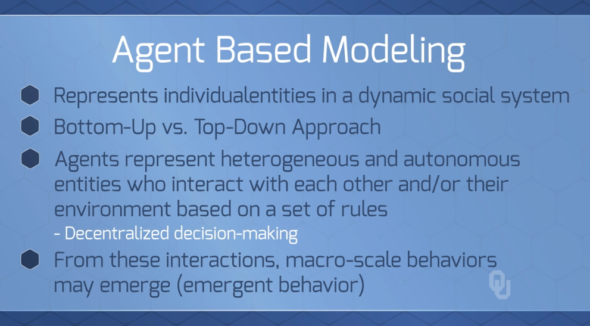  
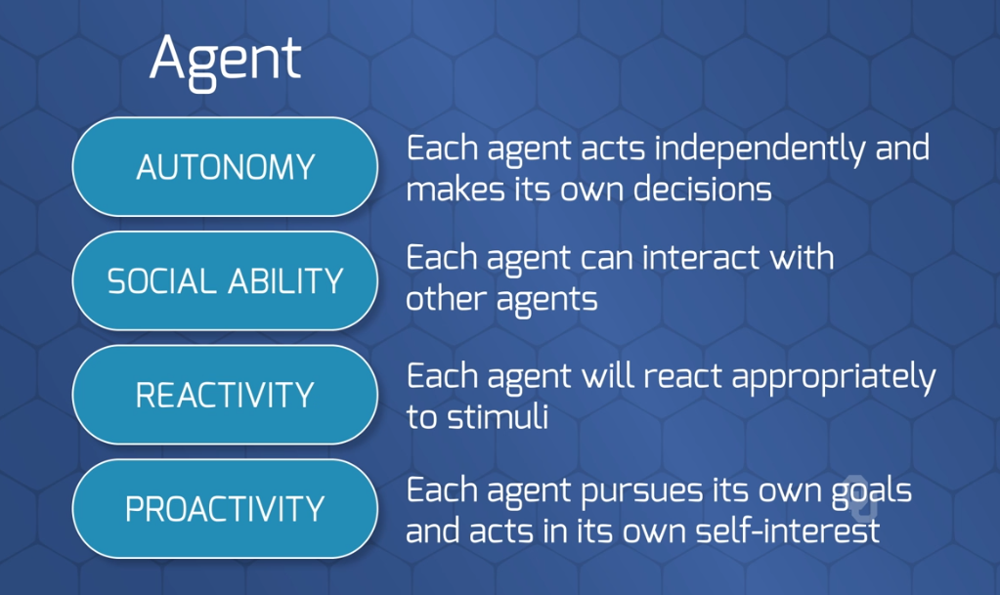  
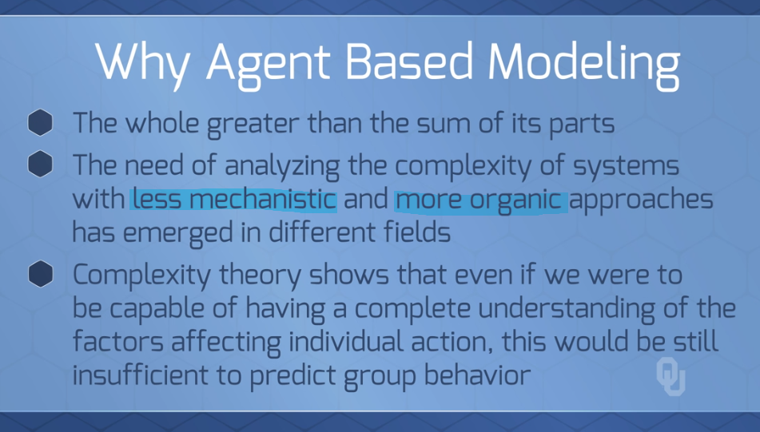  
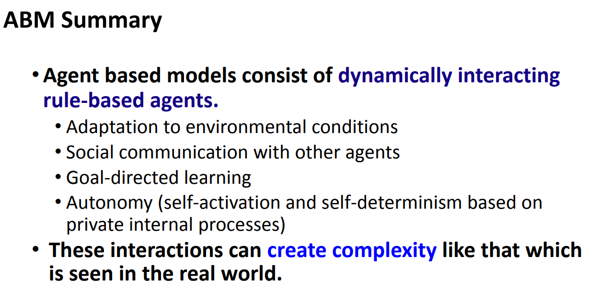  

### 1.2 Applications of ABM (Agent Based Modeling)
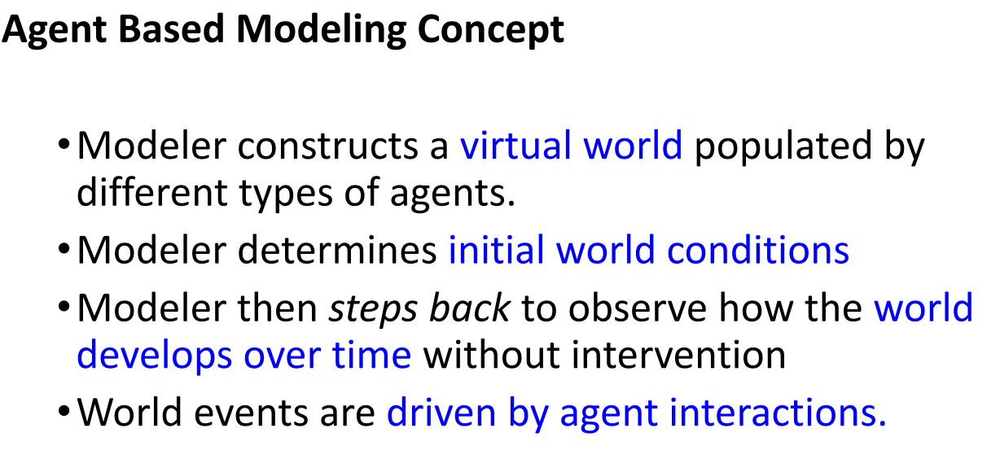  
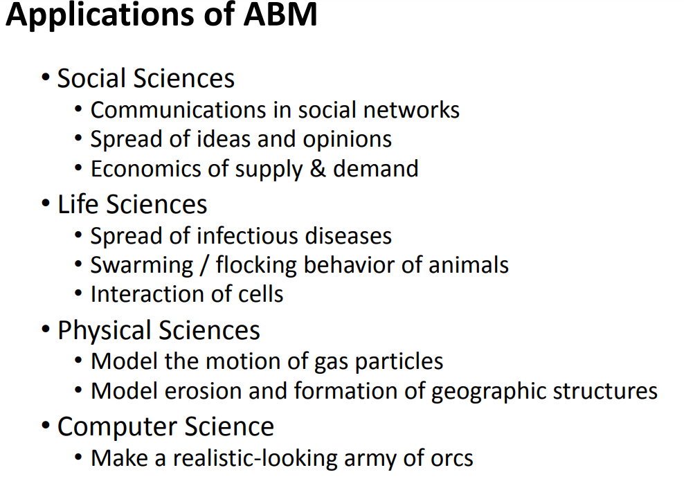  

 

### 1.3 `Swarm Intelligence`
* Small decisions of each agent (e.g., ant) add up to the decisions of the group
* No one is in charge, but the colony functions fine
* Relies on very small interactions between ant-to-ant interaction
    * Interactions detect if another `patroller` ant has left the nest or not
    * When the rate of `patroller` ants returning to the nest decreases to a certain level, the `forager` leaves the nest to get food
    * A `forager` must find something before coming back
    * These interactions can lead to *complex* overall decisions

---
 

## 2. `Emergent Behavior`
> Emergent Behavior was the predecessor to Agent Based Modeling  
> E.g., Simply models swarms of `birds`/`fish` and their cohesive movements 

## Overview of `Emergent Behavior` Modeling 
1. Game of Life
2. Segregation Model
3. Boids Model (flocking)

### 2.1 `Game of Life`
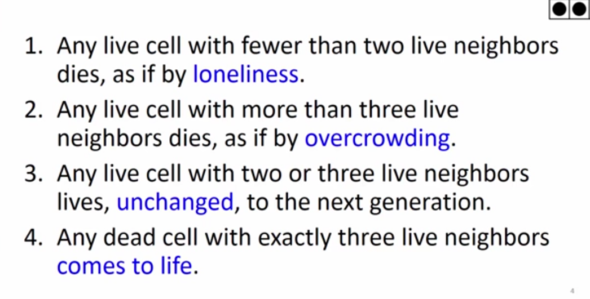  
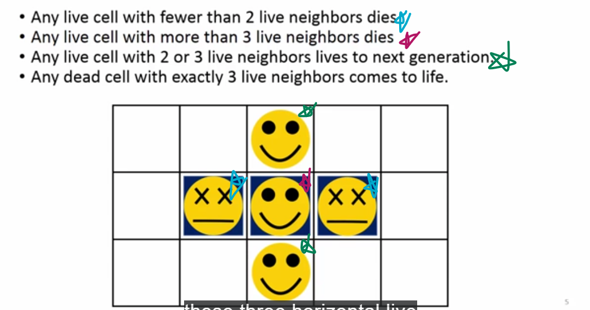  
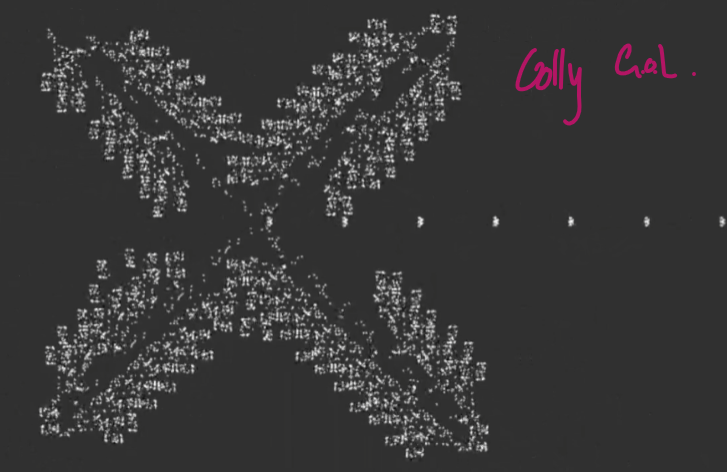  

 

### 2.2 `Segregation Model`
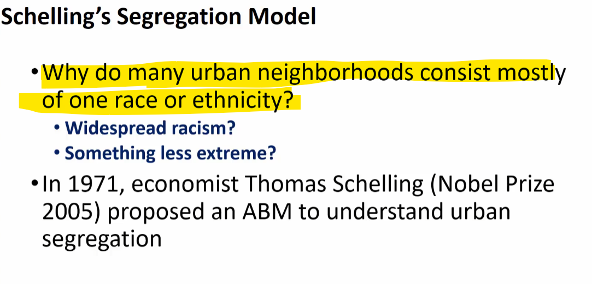  
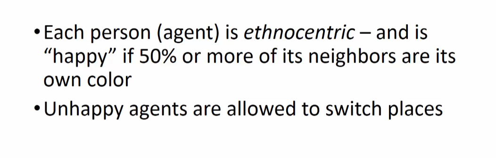  
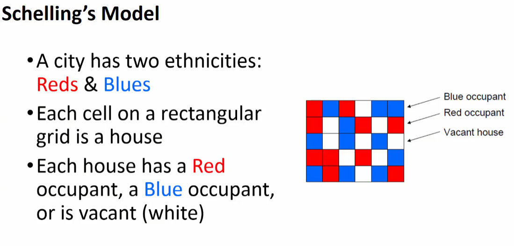  
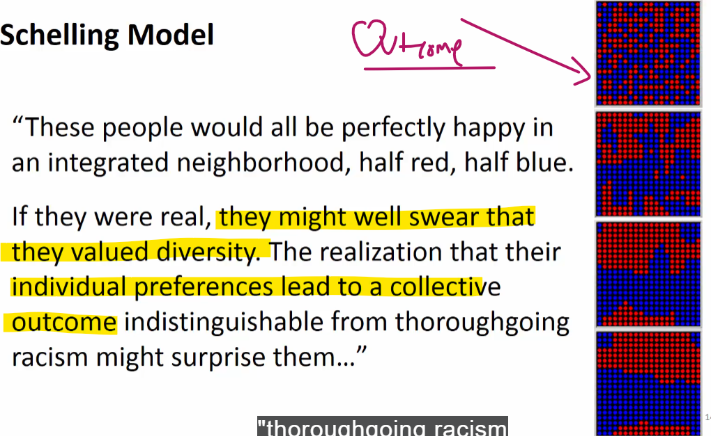  

### 2.3 Boids Model (`flocking`)
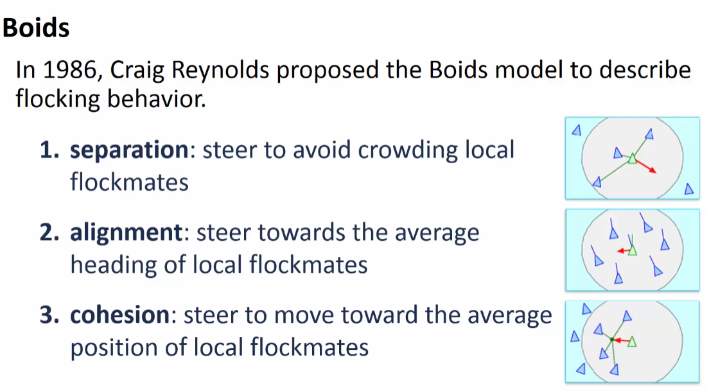  
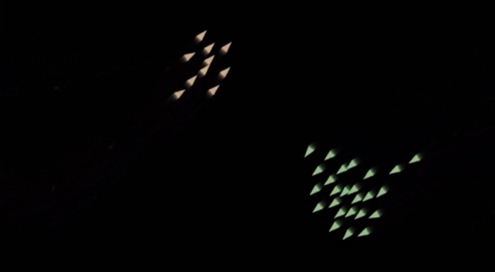  

                             

