# Partical Swarm Optimization (*PSO*)
> Swarm intelligence that mimics groups of individual fish or birds swarming together towards an overall objective

## Content Overview
1. `PSO` vs `Genetic Algorithm`
2. Defining `Movement`: Inertia, Cognitive and Social Influence
3. Defining the `Swarm` vs. `Particles` 
4. PSO `Algorithm` Steps (*overview*)
4. PSO `Algorithm` Details

---

 

### Conceptual Overview
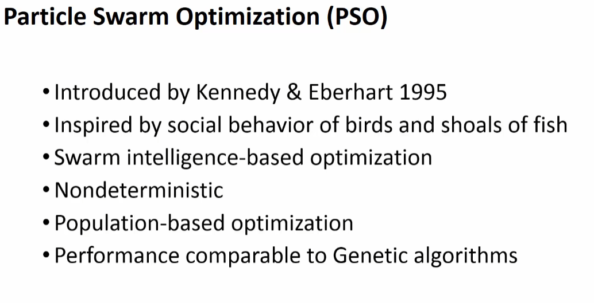  

### Visualizing `Swarms Intelligent` in Optimization?
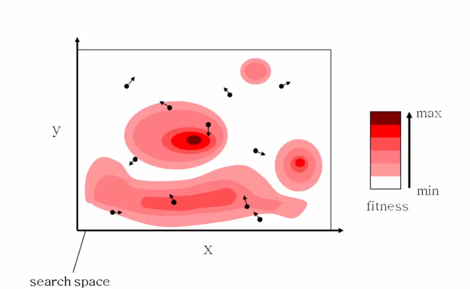  
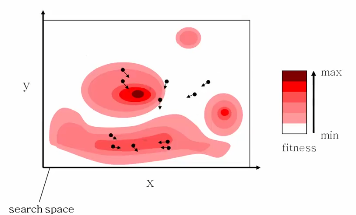  
  
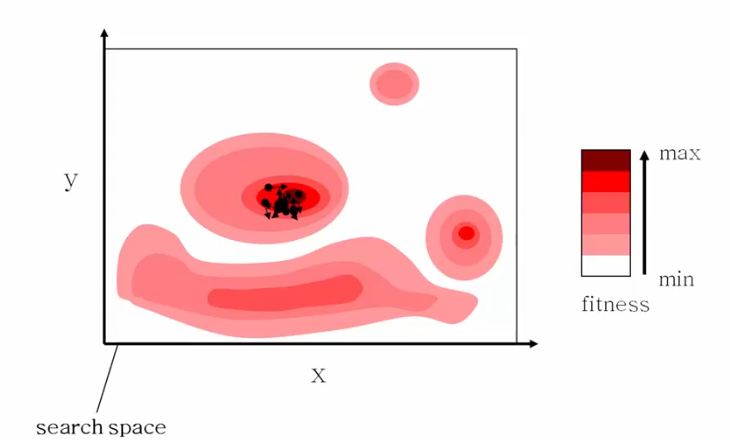  
---

 

## 1. `PSO` vs `GA`
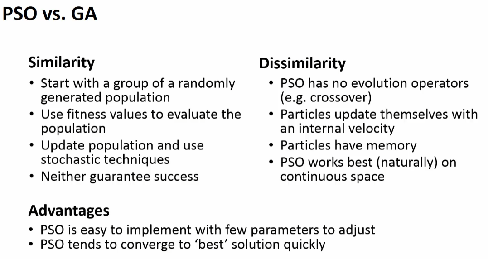  

---

 

## 2. Defining `Movement`: Inertia, Cognitive and Social Influence
> `Movement` is how the paricle goes about the space. 3 factors: 

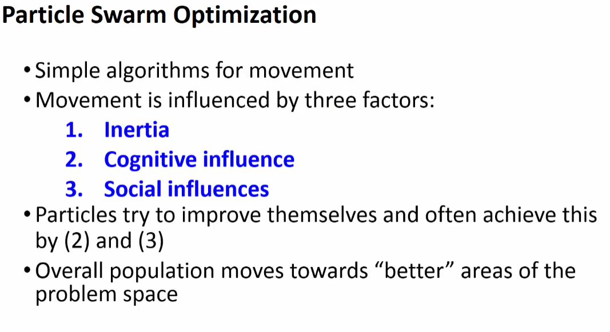    

Variable              | Description
----------------------|--------------
`Interia`             | Particle continues to *move in the direction it has been going*
`Cognitive Influence` | Pariticle uses its own memory to adjust the right direction for itself to move
`Social Influence`    | Info that is obtains from other particles in the space.

---

 

## 3. Defining the `Swarm` vs. `Particles` 
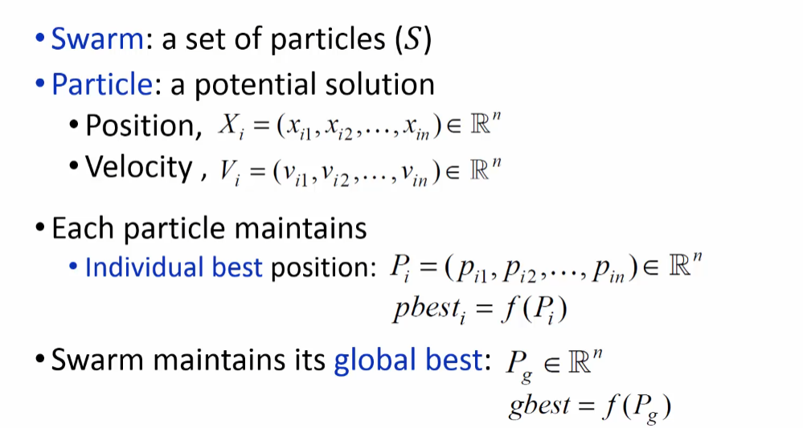  

---

 

## 4. PSO Algorithm Steps
1. `Initialize` the swarm from the solution space
2. `Evaluate` the fitness of each partical
3. `Update` the individual and global best solutions
4. For each particle, update the `velocity` and the `position`
5. Go back to `step 2`, then `repeat until` we meet the `stopping criteria`

### 4.4 Update the `Velocity` and `Position` of `Particle[i]`

### 4.4.1 `Updating the Velocity`
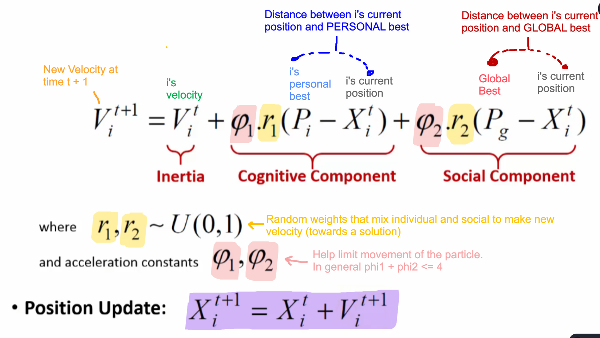  
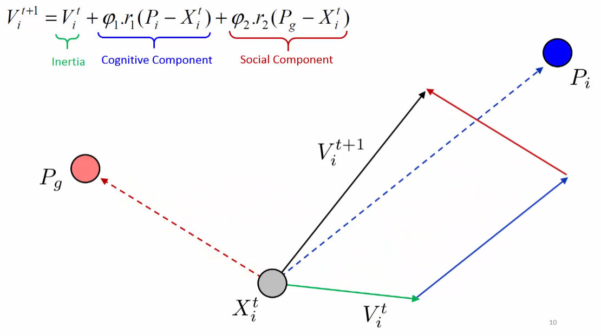
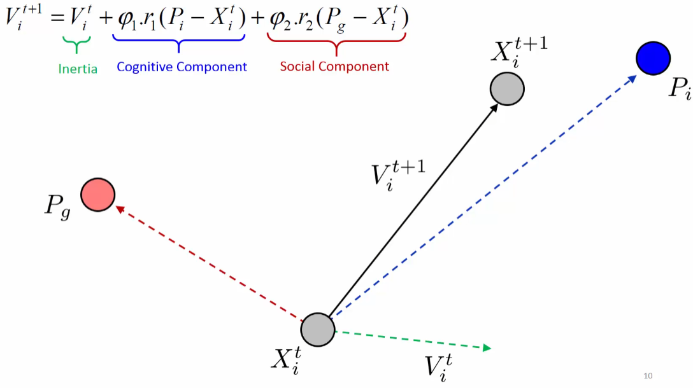  

### 4.4.2 `Limiting the Movement of Particles`
> Acceleration constants help limit particle movement  
> Large values of `phi` could cause particle to leave too quickly 

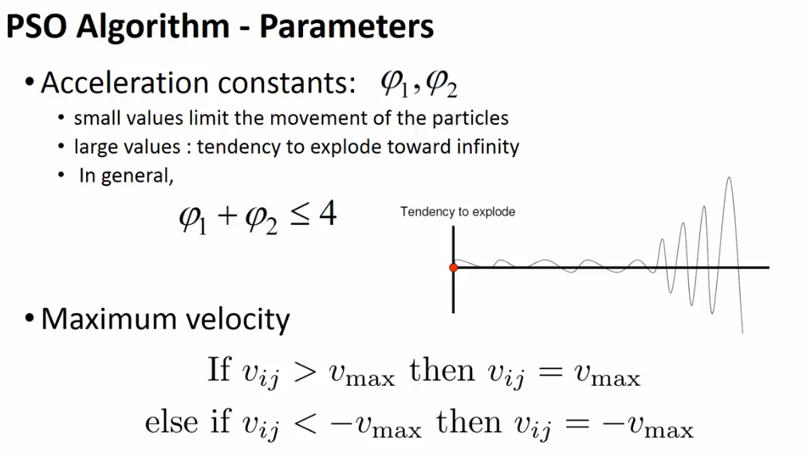  

### 4.4.3 Balancing `Exploration` and `Exploitation`
> Could force more exploration of area but disable swarm movement in later iterations  

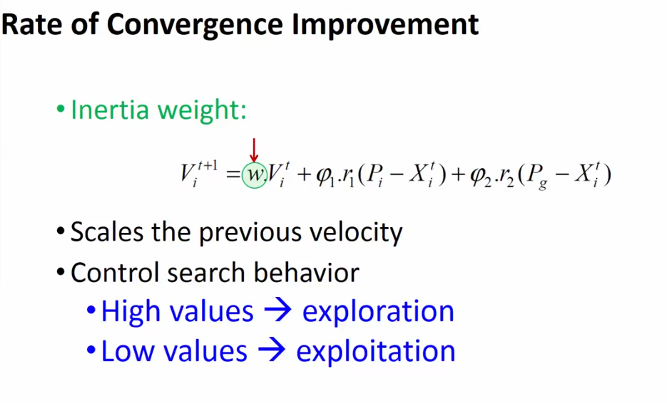  
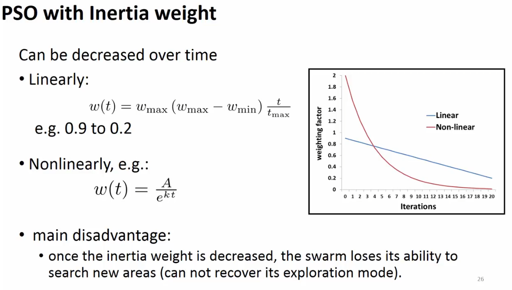  

