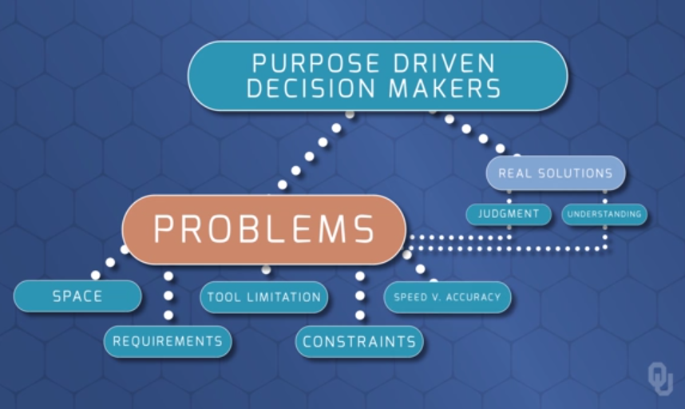
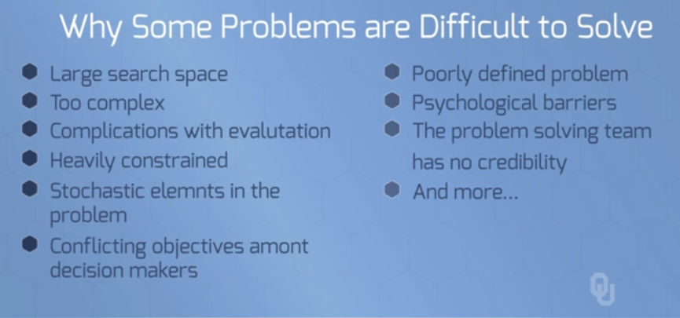

# Problem Solving

## Unit Objectives
1. Identify characteristics that make some problems hard to solve
2. Explain the TSP, Boolean SAT, and non-linear programming as mathematical problems
3. Interpret and use mathematical logic notation
4. Describe the problem-solving paradigm used in the course

 

---

## 1. Identify `characteristics that make some problems hard to solve`

### What goes into solving a problem?

 

### Why are they hard to solve?

 

---

## 2. Explain the `TSP`, `Boolean SAT`, and `non-linear programming` as mathematical problems

 

---

## 3. Interpret and use `mathematical logic notation`

 

---

## 4. Describe the `problem-solving paradigm` used in the course