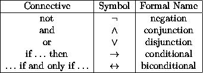
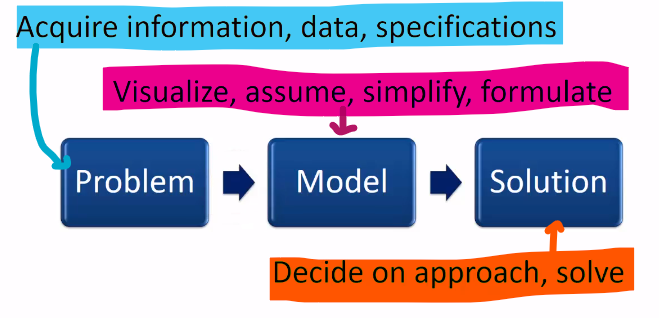

# Problem Solving

## Quotes:
* "All models are wrong, but some are useful"  
* We use the solution to the model, not the actual problem

## Unit Objectives
1. Identify characteristics that make some problems hard to solve
2. Explain the TSP, Boolean SAT, and non-linear programming as mathematical problems
3. Interpret and use mathematical logic notation
4. Describe the problem-solving paradigm used in the course

<br>

---

## 1. Identify `characteristics that make some problems hard to solve`

### What goes into solving a problem?


<br>

### Why are they hard to solve?


<br>

---

## 2. Explain the `TSP`, `Boolean Satisfiability`, and `non-linear programming` as mathematical problems

### 2.1 `Boolean Satisfiability`
> Assign each variable a truth value so that the overall output is `TRUE`

* Problems:
    1. Only results in `true` or `false`, not more info
    2. Very slow to evaluate. 
        ```
        searchSpace = 2^numVariables
        ```

### 2.2 `Traveling Salesman (TSP)`
> Minimum distance traveled while traveling through each destination once  
* Size of the problem exponentiates as the number of destinations traveled increases
    ```
    possibleRoutes = (n - 1)! / 2
    ```

<br>


### 2.3 `Non-Linear Programming`
> Non-linear in parameters

<br>

---

## 3. Interpret and use `mathematical logic notation`
* [Truth Table Calculator Tool](https://web.stanford.edu/class/cs103/tools/truth-table-tool/)

### 3.1  Overview of `truth table`
Operator | Operand | Final Evalutation
-|-|-
`AND` | `FALSE` | `FALSE`
`OR`  | `TRUE`  | `TRUE`

### 3.2 Logical Symbols


<br>

---

## 4. Describe the `problem-solving paradigm` used in the course

### The fundamental paradigm to approaching optimization problems
1. Acquire information, data, specifications to `define a problem`
2. Then visualize, simplify and `formulate a model`
3. Finally, decide on an approach to `produce a solution`.

    <br>
    
