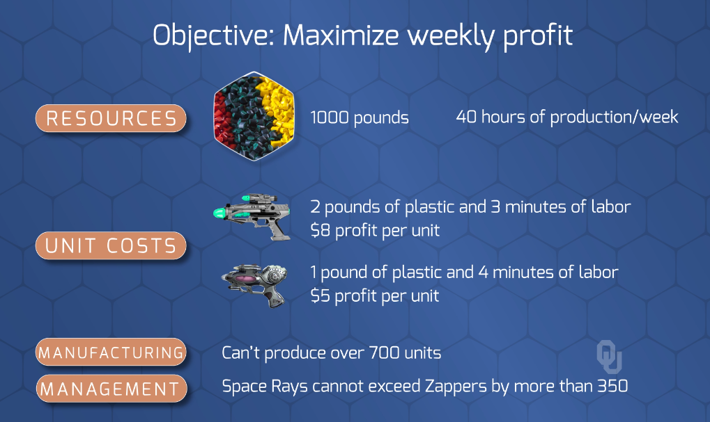

# Snapshot of Modeling

## Overview of Setup

 <br>

---

## Code to Model
> `AMPL` Code
```AMPL
# Galaxy Industries Linear Programming Problem
reset;

# Set up options and the solver
option solver cplex;
option cplex_options 'sensitivity';

# DECISION VARIABLES ---------------------------------------------

## Number of Space Ray Products
var product1 >= 0;

## Number of Zapper Products
var product2 >= 0;

# OBJECTIVE -----------------------------------------------------
maximize profit: (8*product1) + (5*product2);

# CONSTRAINTS -----------------------------------------------------
subject to plastic:    (2*product1) + (1*product2) <= 1000;
subject to labor:      (3*product1) + (4*product2) <= 2400;
subject to production:   (product1) +   (product2) <= 700;
subject to management:    (product1) -  (product2) <= 350;

# SOLVE ---------------------------------------------------------

## Solve the model
solve;

## Get the lower and upper bound shadow prices
## (Range of the decision variables in which the optimal solution stays the same)

print;
print 'Product 1: Optimal Values and the Range of OPTIMALITY';
print 'Optimality will stay the same as long as the profit coefficient stays between and product2.up and product2.down';
display product2, product2.up, product2.down;

print 'Product 2: Optimal Values and the Range of OPTIMALITY';
print 'Optimality will stay the same as long as the profit coefficient stays between and product1.up and product1.down';
display product1, product1.up, product1.down;

print 'Plastic Constraint Shadow Price and the Range of FEASIBILITY';
print 'For every pound increased in plastic, we will improve profitability by the value of plastic (up to value of plastic.up), same goes for decrease';
print 'This constraint will be feasible within the ranges of plastic.up and plastic.down';
display plastic, plastic.up, plastic.down;

print 'Labor Constraint Shadow Price and the Range of FEASIBILITY';
display labor, labor.up, labor.down;

print 'Production Constraint Shadow Price and the Range of FEASIBILITY';
print 'Shadow Price of production = 0 since the constraint is not active';
display production, production.up, production.down;

print 'Management Constraint Shadow Price and the Range of FEASIBILITY';
print 'Shadow Price of management = 0 since the constraint is not active';
print 'Upper bound = infinity since there is no upper limit';
display management, management.up, management.down;
```

> Run Model
```
# Code that you would need to run in AMPL Console
## model models\galaxyLP.txt;
```

> Output
```
ampl: include 'C:\Users\daniel.carpenter\OneDrive - the Chickasaw Nation\Documents\GitHub\OU-DSA\Metaheuristics\02 - Notes and Quizzes\03 - Intro to LP\Example LP\AMPL Example\models\galaxyLP.txt';
CPLEX 20.1.0.0: sensitivity
CPLEX 20.1.0.0: optimal solution; objective 4360
2 dual simplex iterations (1 in phase I)

suffix up OUT;
suffix down OUT;
suffix current OUT;

Product 1: Optimal Values and the Range of OPTIMALITY
Optimality will stay the same as long as the profit coefficient stays between and product2.up and product2.down
product2 = 360
product2.up = 10.6667
product2.down = 4

Product 2: Optimal Values and the Range of OPTIMALITY
Optimality will stay the same as long as the profit coefficient stays between and product1.up and product1.down
product1 = 320
product1.up = 10
product1.down = 3.75

Plastic Constraint Shadow Price and the Range of FEASIBILITY
For every pound increased in plastic, we will improve profitability by the value of plastic (up to value of plastic.up), same goes for decrease
This constraint will be feasible within the ranges of plastic.up and plastic.down
plastic = 3.4
plastic.up = 1100
plastic.down = 600

Labor Constraint Shadow Price and the Range of FEASIBILITY
labor = 0.4
labor.up = 2500
labor.down = 1750

Production Constraint Shadow Price and the Range of FEASIBILITY
Shadow Price of production = 0 since the constraint is not active
production = 0
production.up = 1e+20
production.down = 680

Management Constraint Shadow Price and the Range of FEASIBILITY
Shadow Price of management = 0 since the constraint is not active
Upper bound = infinity since there is no upper limit
management = 0
management.up = 1e+20
management.down = -40
```