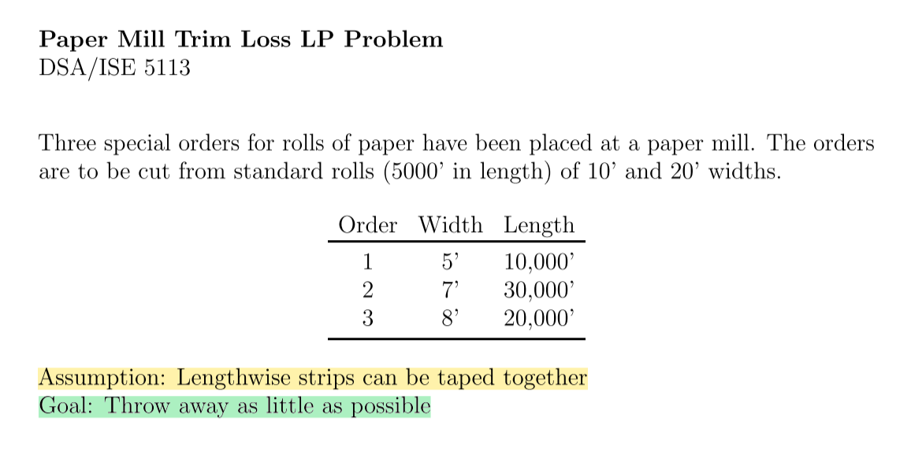
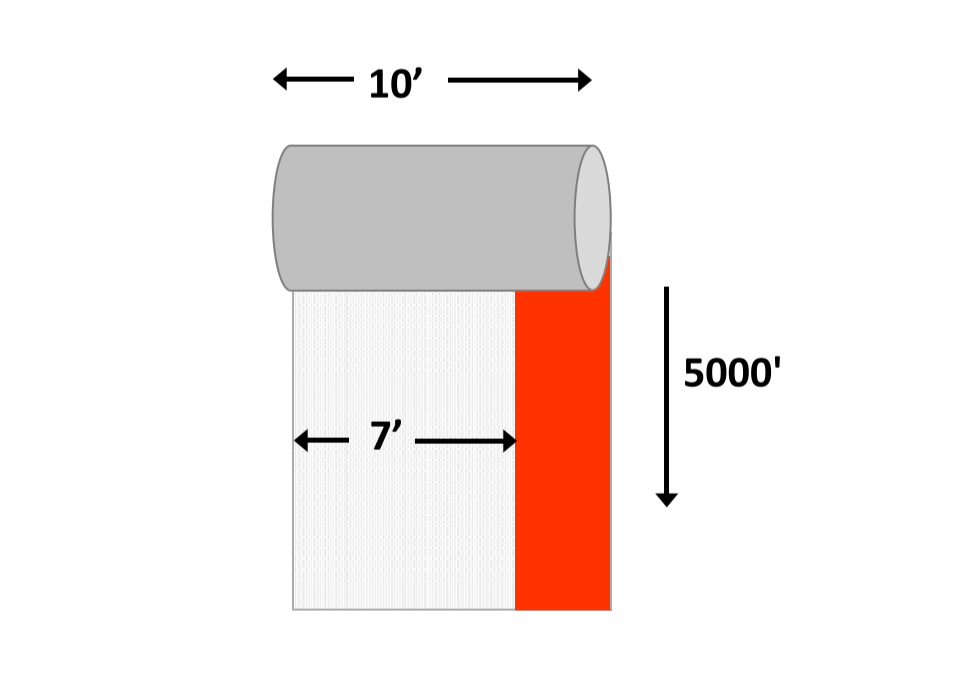
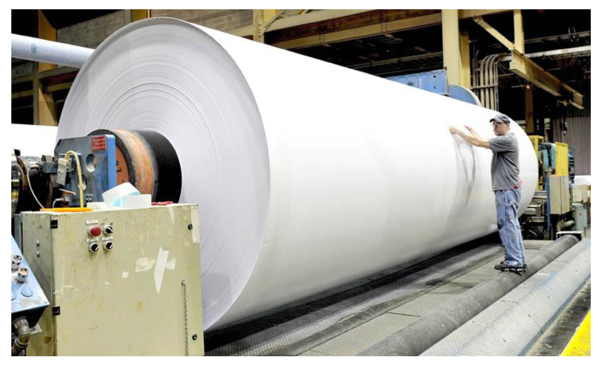
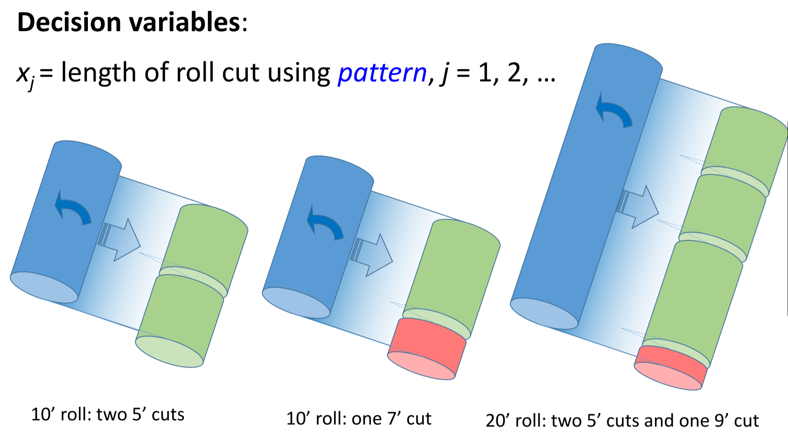
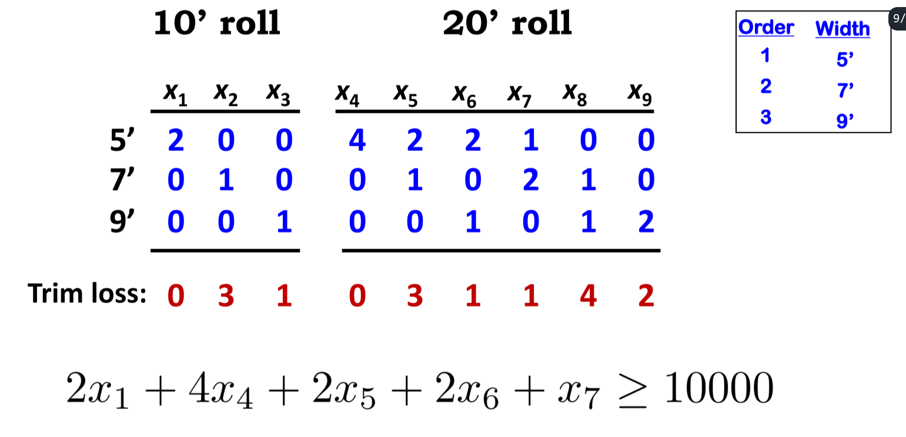
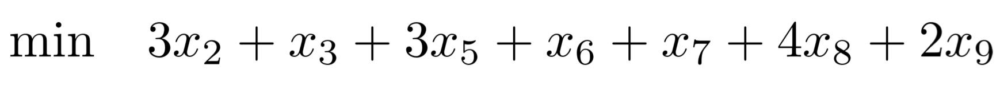
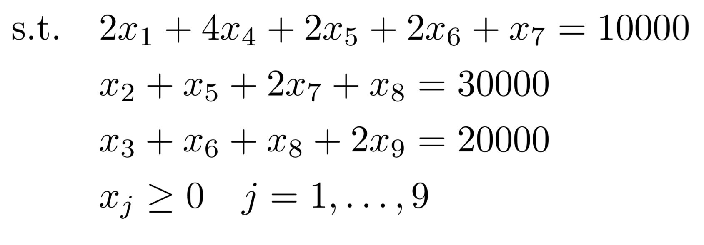

# Advanced Linear Programming (LP)
> Cutting Stock (Trim-Loss)

* Typical use of this model is for `minimizing the amount of unused stock` in manufacturing process.
* For example you may have orders that are for `various sizes`, and you want to use as much as possible to reduce waste.

## *Overview* of Problem
 <br>

 <br>

---

## Mathetmatical Formulation

### `Sets`  

`CUTS`: The number of ways (or patterns) to cut the paper  

<!-- ### `Parameters`
 <br> -->

### `Decision Variables`
* Many combination of cuts exist, which could be extensive to come up with that list  

 <br>
 <br>

### `Objective Function`
 <br>

### `Constraints`
 <br>

---

## Code
* (See simple example in `Models Directory`)

### Data Inputs *`trimLoss-2.dat`*
```py
#AMPL data file LP version of the trim loss problem

data;

set WIDTHS := 5in 7in 9in;

param orders:= 5in 10000
               7in 30000
               9in 20000;

set CUTS := 1 2 3 4 5 6 7 8 9;

#trim loss associated with each cut pattern
param  loss   :=
   1        .   
   2        3    
   3        1    
   4        .   
   5        3    
   6        1    
   7        1    
   8        4    
   9        2;

#patterns associated with each order
param usage:   1 2 3 4 5 6 7 8 9   :=
        5in    2 . . 4 2 2 1 . .
        7in    . 1 . . 1 . 2 1 .
        9in    . . 1 . . 1 . 1 2 ;
```

<br>

### Model *`trimLoss-2.txt`*

```py
#AMPL code for the LP version of the trim loss problem
# model and data are separated

reset;
option solver cplex;

#sets and parameters

set WIDTHS;
param orders {WIDTHS} > 0;

set CUTS;  #ID's of possible cut patterns


param loss{CUTS} default 0;  #trim loss associated with each pattern

param usage{WIDTHS, CUTS} default 0;   # usage patterns for widths and cuts


#decision variables
var x{CUTS} >=0;

minimize trimloss: sum{i in CUTS} loss[i]*x[i]; 

subject to demand {w in WIDTHS}: sum{i in CUTS} usage[w,i]*x[i] = orders[w] ;


data trimloss-2.dat;

solve;
display x;
```

<br>

> Output
```
CPLEX 20.1.0.0: optimal solution; objective 60000
3 dual simplex iterations (0 in phase I)
x [*] :=
1      0
2  10000
3      0
4      0
5      0
6      0
7  10000
8      0
9  10000
;
```
