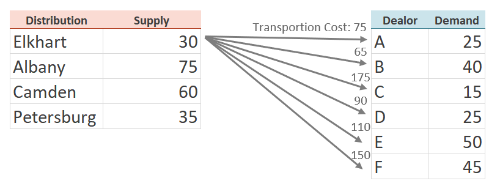

# Network Flow Modeling
> Transportation Problem `via Minimum Cost Flow`  
> ***SEE SLIDES IN PARENT DIRECTORY***

* Typical use of this model is for `Supply` and `Demand`. 
* Other application: `Assignment` problem (*assigning to time slots, tasks, positions, programs*). See Slides for problem overview
* If unmet supply or demand, use dummy node and add penalty cost for using it (if desired)

## *Overview* of Problem
 <br>

* For example, the `transportation cost` from `Elkhart` to the `Dealors`
 <br>

---

## Mathetmatical Formulation

 <br>
 <br>

---

## Code

### Data Inputs *`data.dat`*
```py
#MCNFP Problem - data file for problem instance
#Charles Nicholson, ISE 5113, 2015

#use with MCNFP.txt model
#note: default arc costs and lower bounds are 0
#      default arc upper bounds are infinity
#      default node requirements are 0


data;

set NODES :=  	IN NY NJ VA A B C D E F ; 

set ARCS := 	(IN, *) A B C D E F 
                (NY, *) A B C D E F 
		(NJ, *) A B C D E F
		(VA, *) A B C D E F;

param b :=
	IN 30
        NY 75
        NJ 60
        VA 35
        A -25
  	B -40
  	C -15
  	D -25
  	E -50
  	F -45;
;

param c:    A   B   C   D   E   F :=
	IN 75  65 175  90 110 150                  
	NY 90  30  45  50 105 130 
	NJ 40  55  35  80  70  75
	VA 95 150 100 115  55  55;
  
```

<br>

### Model *`baseModel.txt`*

```py
# AMPL model for the Minimum Cost Network Flow Problem
#
# By default, this model assumes that b[i] = 0, c[i,j] = 0,
# l[i,j] = 0 and u[i,j] = Infinity.
#
# Parameters not specified in the data file will get their default values.

options solver cplex;

set NODES;                        # nodes in the network
set ARCS within {NODES, NODES};   # arcs in the network 

param b {NODES} default 0;        # supply/demand for node i
param c {ARCS}  default 0;        # cost of one of flow on arc(i,j)
param l {ARCS}  default 0;        # lower bound on flow on arc(i,j)
param u {ARCS}  default Infinity; # upper bound on flow on arc(i,j)

var x {ARCS};                     # flow on arc (i,j)
 
minimize cost: sum{(i,j) in ARCS} c[i,j] * x[i,j];  #objective: minimize arc flow cost

# Flow Out(i) - Flow In(i) = b(i)

subject to flow_balance {i in NODES}:
sum{j in NODES: (i,j) in ARCS} x[i,j] - sum{j in NODES: (j,i) in ARCS} x[j,i] = b[i];

subject to capacity {(i,j) in ARCS}: l[i,j] <= x[i,j] <= u[i,j];
```

<br>

<!-- > Output
```
``` -->
