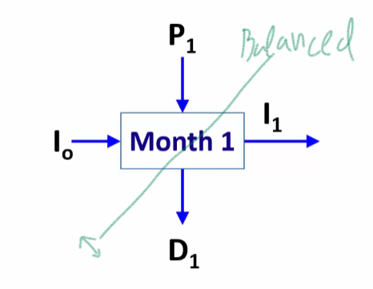

# Network Flow Modeling
> Multiperiod Planning `via Minimum Cost Flow`  
> ***SEE SLIDES IN PARENT DIRECTORY***
* Typical use of this model is for production companies that are able to hold inventory and expect higher prices in future periods
* Note additional models (not included in this readme have multi-commodity)

## *Overview* of Problem
 <br>
 <br>
 <br>
* Whatever goes in must go out, but could store it

---

## Mathetmatical Formulation

 <br>
 <br>

---

## Code

### Data Inputs *`data.dat`*
```py
#NSC MCNFP Problem Formulation - data file for problem instance
#Charles Nicholson, ISE 5113, 2015

#use with MCNFP.txt model
#note: default arc costs and lower bounds are 0
#      default arc upper bounds are infinity
#      default node requirements are 0


set NODES :=  	p1 p2 p3 p4          #production nodes for each time period 1,2,3, and 4
           	d1 d2 d3 d4 dummy    #demand nodes per time period; "dummy" is to balance problem
        	i0 i1 i2 i3 i4;      #inventory nodes (i0 = initial inventory)   


set ARCS := 	(i0, *) d1 i1        #inventory used to meet demand; inventory held over 
        	(i1, *) d2 i2
		(i2, *) d3 i3
		(i3, *) d4 i4

		(p1, *) d1 i1 dummy  #production to: meet demand, hold in inventory, or not-produced
		(p2, *) d2 i2 dummy
		(p3, *) d3 i3 dummy
		(p4, *) d4 i4 dummy;


param b:=
	p1    4000     #max monthly production
	p2    4000
	p3    4000 
	p4    4000

	d1    -2400    #monthly demand	
	d2    -2200 
	d3    -2700 
	d4    -2500
	dummy -5700

	i0    1000     #starting inventory
	i4   -1500;    #required final inventory


param c:=
	[i0, *] i1 120 d1   0     #inventory holding costs
	[i1, *] i2 120 d2 120 
	[i2, *] i3 120 d3 120
	[i3, *] i4 120 d4 120

	[p1, *] d1 7400	 i1 7400  #monthly production cost per ton of steel 	
	[p2, *] d2 7500	 i2 7500	
	[p3, *] d3 7600  i3 7600
	[p4, *] d4 7800  i4 7800;
```

<br>

### Model *`model.txt`*

```py
# AMPL model for the Minimum Cost Network Flow Problem
#
# By default, this model assumes that b[i] = 0, c[i,j] = 0,
# l[i,j] = 0 and u[i,j] = Infinity.
#
# Parameters not specified in the data file will get their default values.

options solver cplex;

set NODES;                        # nodes in the network
set ARCS within {NODES, NODES};   # arcs in the network 

param b {NODES} default 0;        # supply/demand for node i
param c {ARCS}  default 0;        # cost of one of flow on arc(i,j)
param l {ARCS}  default 0;        # lower bound on flow on arc(i,j)
param u {ARCS}  default Infinity; # upper bound on flow on arc(i,j)

var x {ARCS};                     # flow on arc (i,j)
 
minimize cost: sum{(i,j) in ARCS} c[i,j] * x[i,j];  #objective: minimize arc flow cost

# Flow Out(i) - Flow In(i) = b(i)

subject to flow_balance {i in NODES}:
sum{j in NODES: (i,j) in ARCS} x[i,j] - sum{j in NODES: (j,i) in ARCS} x[j,i] = b[i];

subject to capacity {(i,j) in ARCS}: l[i,j] <= x[i,j] <= u[i,j];
```

<br>

<!-- > Output
```
``` -->
