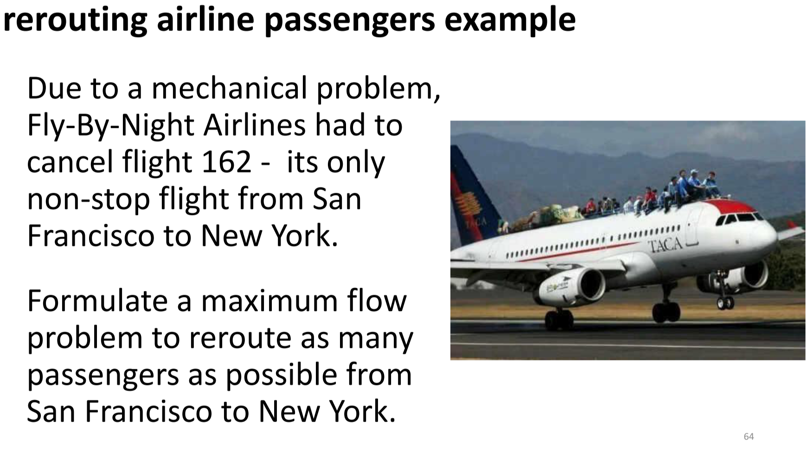
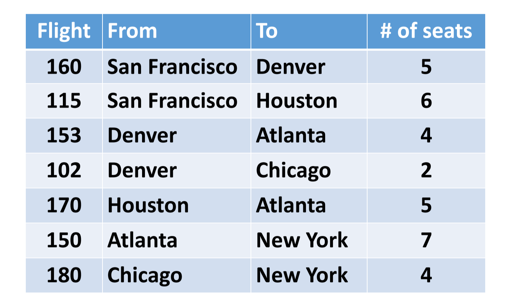
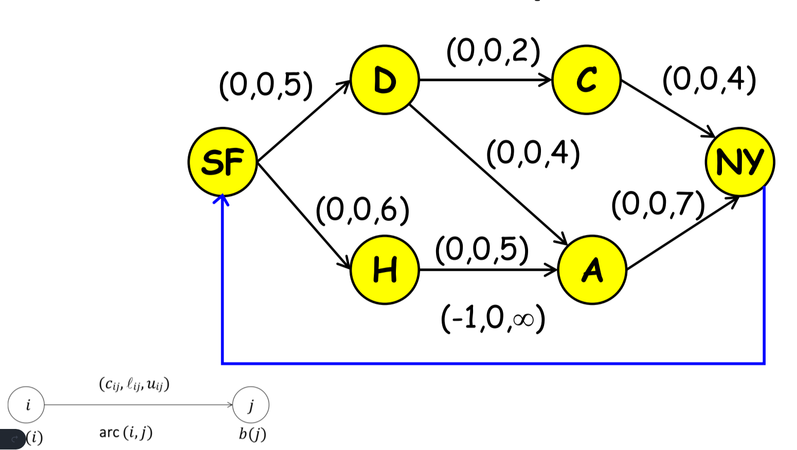
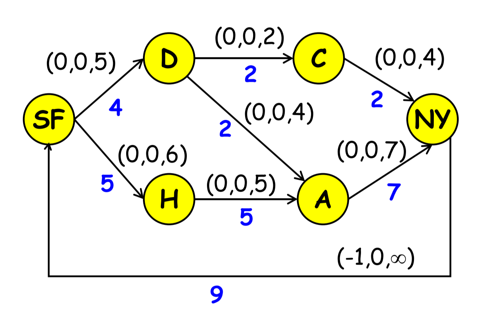

# Network Flow Modeling
> Max Flow `via Minimum Cost Flow` Modeling  
> * SEE SLIDES
* Max Value from point `a` to `b`. Many applications - Maximize the number of people that you want to fly on an airplane from point `a` to `b`
* Common way to go about is to make it a `Circulation Problem` *(See slides)*

---

## *Overview* of Problem
 <br>
 <br>
 <br>

## Optimal Solution
 <br>

## Code

### Data Inputs *`data.dat`*
```py
#Max flow MCNFP Problem Formulation - data file for problem instance in lecture "Fly-By-Night"
#Charles Nicholson, ISE 5113

#use with MCNFP.txt model
#note: default arc costs and lower bounds are 0
#      default arc upper bounds are infinity
#      default node requirements are 0


set NODES :=  	SF D H C A NY;

set ARCS := 	(SF,D) (SF,H) (D,A) (D,C) (H,A) (C,NY) (A,NY) 
		(NY,SF);


#max flow problem requires setting upper bounds (on almost all arcs) and flow cost on 1 arc.

param u:=	[SF,D] 5
		[SF,H] 6
		[D,A]  4
		[D,C]  2
		[H,A]  5
		[C,NY] 4
		[A,NY] 7;

param c:=	[NY, SF] -1;	#only the "circulation" arc has an associated cost
```

<br>

### Model *`model.txt`*

```py
# AMPL model for the Minimum Cost Network Flow Problem
#
# By default, this model assumes that b[i] = 0, c[i,j] = 0,
# l[i,j] = 0 and u[i,j] = Infinity.
#
# Parameters not specified in the data file will get their default values.

options solver cplex;

set NODES;                        # nodes in the network
set ARCS within {NODES, NODES};   # arcs in the network 

param b {NODES} default 0;        # supply/demand for node i
param c {ARCS}  default 0;        # cost of one of flow on arc(i,j)
param l {ARCS}  default 0;        # lower bound on flow on arc(i,j)
param u {ARCS}  default Infinity; # upper bound on flow on arc(i,j)

var x {ARCS};                     # flow on arc (i,j)
 
minimize cost: sum{(i,j) in ARCS} c[i,j] * x[i,j];  #objective: minimize arc flow cost

# Flow Out(i) - Flow In(i) = b(i)

subject to flow_balance {i in NODES}:
sum{j in NODES: (i,j) in ARCS} x[i,j] - sum{j in NODES: (j,i) in ARCS} x[j,i] = b[i];

subject to capacity {(i,j) in ARCS}: l[i,j] <= x[i,j] <= u[i,j];
```

<br>
<!-- 
> Output
```
``` -->
