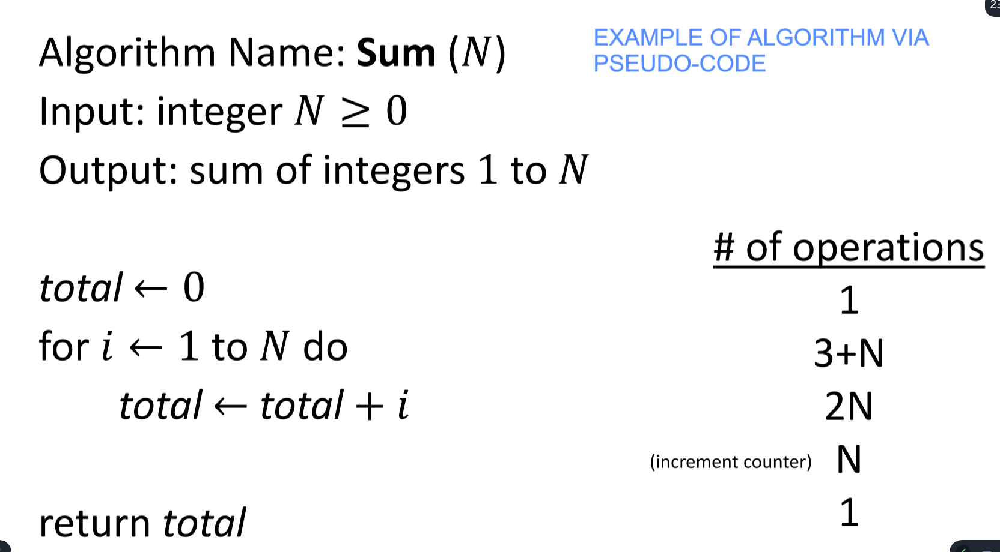
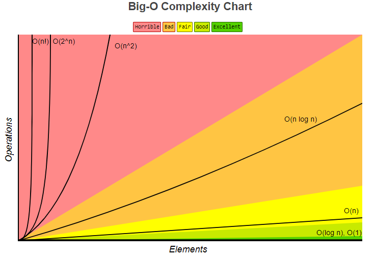
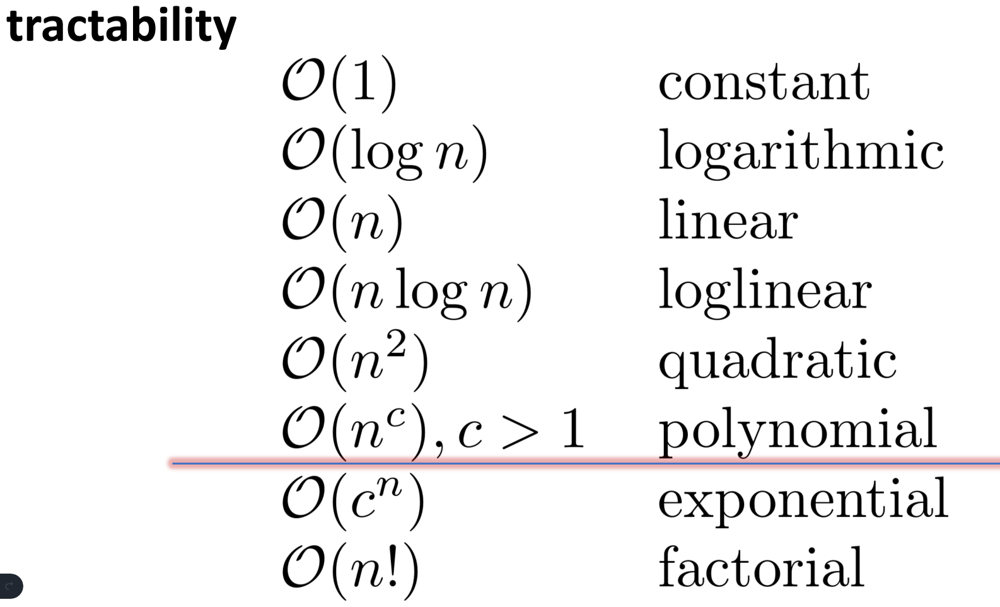

# Algorithm Complexity
* Read and interpret `pseudocode`
* Describe `worst-case analysis`
* Correctly use “`Big-O`”, “`Big-Theta`”, and “`Big-Omega`” notation
* Recognize constant, *linear*, *logarithmic*, *polynomial*, *exponential*, and *factorial* `growth rates`
* Explain the problem sets `P`, `NP`, `NP-complete`, and `NP-hard`
* Discuss the `importance of the P=NP` question

---
 

## Example of `pseudo code` by adding up each number from `1` to `N`
*Also shows the number of opertations*

---
 

## `Big O` Complexity 

   

---
 

## `P = NP?`
> **Interpretation:** Does an algorithm take the same amount of time to solve a problem on the *worst* computer in the world `P` as it does the *best* computer in the world `NP`?

* In general, currently not solved.
* [Resource and discussion on P=NP](https://towardsdatascience.com/the-aged-p-versus-np-problem-91c2bd5dce23)

### Summary of Variables `P` and `NP`

Variable | Lehmans term name
-----|------------------------
`P`  | Worst
`NP` | Best *(regardless of resources)*
