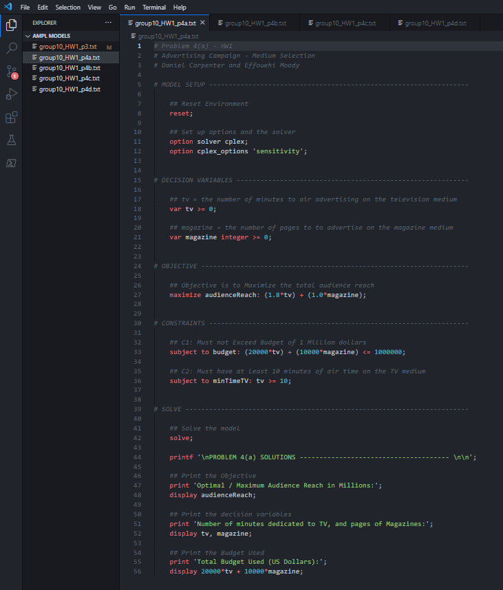

```{r setup, include=FALSE}
knitr::opts_chunk$set(echo = TRUE)
```

---

# Problem `1`

---

<br>

# Problem `2`

---

<br>

# Problem `3`

---

## Task `a` 

### Decision Variables

`bondA`: dollars $\in \mathbb{R}$ to invest in bond A  
`bondB`: dollars $\in \mathbb{R}$ to invest in bond B  
`bondC`: dollars $\in \mathbb{R}$ to invest in bond C  
`bondD`: dollars $\in \mathbb{R}$ to invest in bond D  
`bondE`: dollars $\in \mathbb{R}$ to invest in bond E  

### Objective Function
* Maximize the Expected Earnings of the portfolio

$$
Maximize \ Z = (0.043 \times bondA) + (0.027 \times bondB) + (0.025 \times bondC) + (0.022 \times bondD) + (0.045 \times bondE)
$$

### Constraints

**C1:** Budget to invest is $10 MM or less
$$
budget: bondA + bondB + bondC + bondD + bondE \leq 10
$$

**C2:** At least $4 million must be invested in government and agency bonds
$$
govtAndAgency: bondB + bondC + bondD \geq 4
$$

**C3:** Average Quality of the Portfolio must not exceed 1.4
$$
avgQuality: (0.6 \times bondA) + (0.6 \times bondB) - (0.4 \times bondC) 
- (0.4 \times bondD) + (3.6 \times bondE) \leq 0
$$

**C4:** The Average Maturity must not Exceed Five Years
$$
avgMaturity: (4 \times bondA) + (10 \times bondB) - (1 \times bondC) 
- (2 \times bondD) - (3 \times bondE) \leq 0
$$

<br>

### Code 


### Output


<br>

---

# Problem `4`

---

## Task `a` 

### Decision Variables

`tv` = the number of minutes $\in \mathbb{R}$ to air advertising on the *television* medium  
`magazine` = the number of pages $\in \mathbb{I}$ to to advertise on the *magazine* medium

### Objective Function
* Maximize the total audience reach

$$
Maximize \ Z = (1.8\times tv) + (1.0 \times magazine)
$$

### Constraints

**C1**: Must not Exceed Budget of 1 Million dollars  
$$
budget: (20,000 \times tv) + (10,000 \times magazine) \leq 1,000,000
$$

**C2**: Must have at least 10 minutes of air time on the TV medium  
$$
minTimeTV: tv \geq 10
$$

<br>

### Code 



### Output


---

<br>


## Task `b`

### Additional Constraint: Labor Time

**C3**: Only 100 person weeks available, given it takes three weeks and one week to create a `tv` and `magazine` minute for advertisement, respectively.  
$$
personWeeks: (3 \times tv) + (1 \times magazine) \leq 100
$$

<br>

### Code 


### Output


---

<br>


## Task `c`

### Additional Constraint: Radio Advertising Medium

### Decision Variables

`tv` = the number of minutes $\in \mathbb{R}$ to air advertising on the *television* medium  
`magazine` = the number of pages $\in \mathbb{I}$ to to advertise on the *magazine* medium
`radio` = the number of minutes $\in \mathbb{R}$ to air advertising on the *radio* medium


### Objective Function
* Maximize the total audience reach

$$
Maximize \ Z = (1.80\times tv) + (1.00 \times magazine) + (0.25 \times radio)
$$

### New Constraints

**C1**: Must not Exceed Budget of 1 Million dollars 
$$
budget: (20,000 \times tv) + (10,000 \times magazine) + (2,000 \times radio) \leq 1,000,000
$$

**C2**: Must have at least 10 minutes of air time on the TV medium  
$$
minTimeTV: tv \geq 10
$$

**C3**: Only 100 person weeks available, given it takes three weeks and one week to create a `tv` and `magazine` minute for advertisement, respectively. It only takes one day for `radio`.  
$$
personWeeks: (3 \times tv) + (1 \times magazine) + (\frac{1}{7} \times radio) \leq 100
$$

<br>

### Code 


### Output


---

<br>


## Task `d`

### Additional Constraints: Miminum Magazine and Maximum Radio Requirements

**C4**: Must sign up for at least 2 magazine pages
$$
minMagazines: magazine \geq 2
$$

**C5**: Must to exceed 120 minutes of radio
$$
maxRadio: radio \leq 120
$$

<br>

### Code 


### Output


