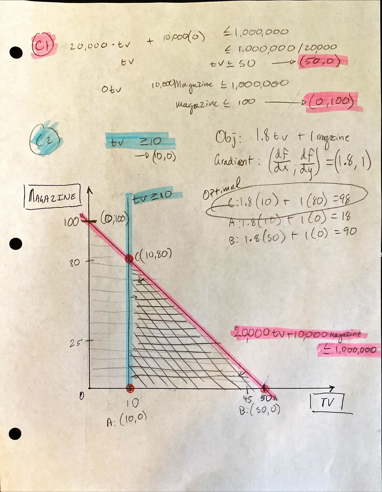
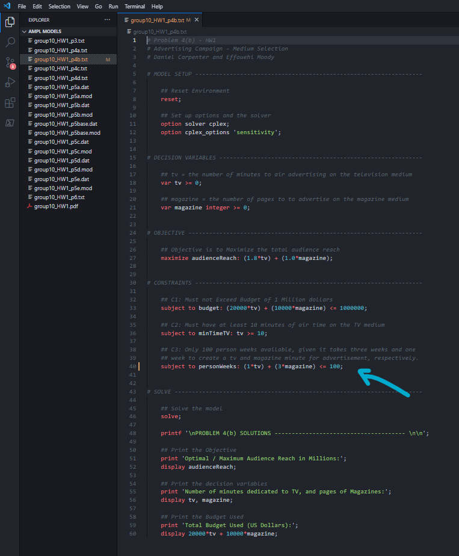
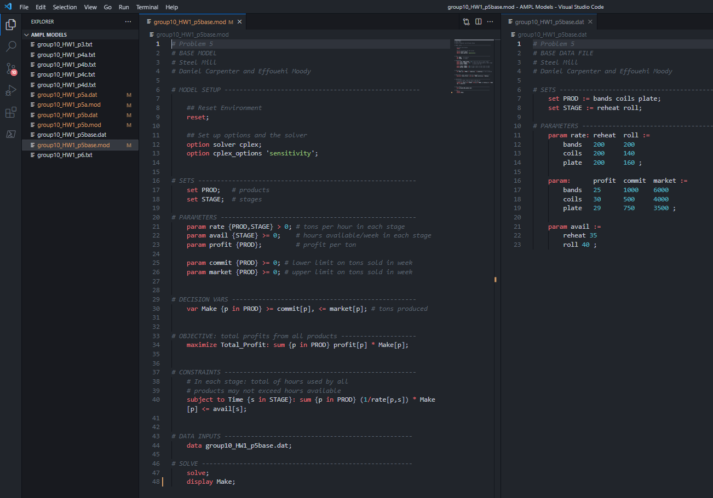
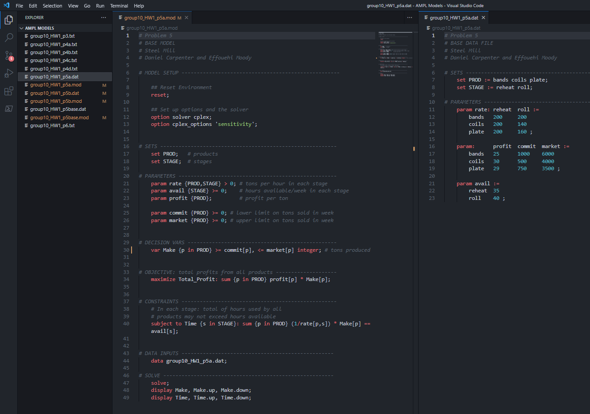
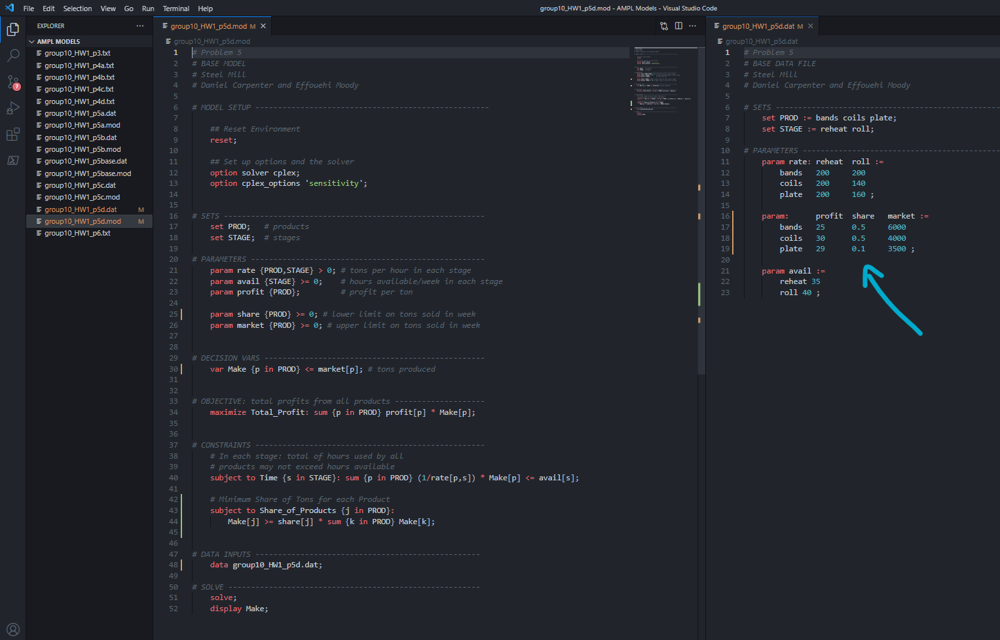
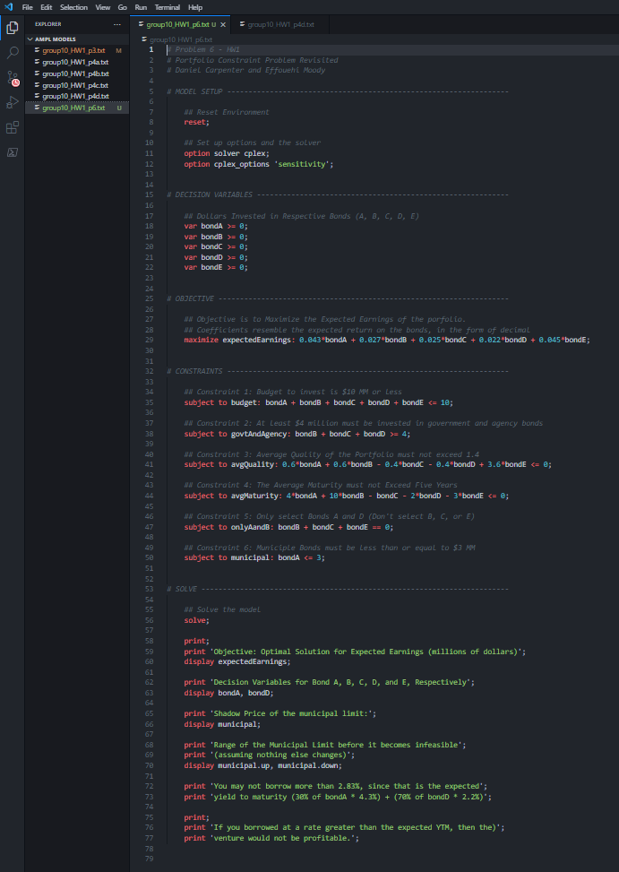
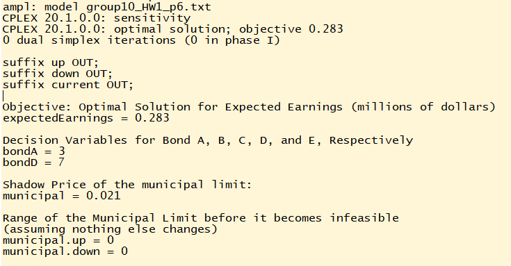

```{r setup, include=FALSE}
knitr::opts_chunk$set(echo = TRUE)
```

---

# Problem `1`

---

<br>

# Problem `2`

---

<br>

# Problem `3`

---

## Task `a` 

### Decision Variables

`bondA`: dollars $\in \mathbb{R}$ to invest in bond A  
`bondB`: dollars $\in \mathbb{R}$ to invest in bond B  
`bondC`: dollars $\in \mathbb{R}$ to invest in bond C  
`bondD`: dollars $\in \mathbb{R}$ to invest in bond D  
`bondE`: dollars $\in \mathbb{R}$ to invest in bond E  

### Objective Function
* Maximize the Expected Earnings of the portfolio

$$
Maximize \ Z = (0.043 \times bondA) + (0.027 \times bondB) + (0.025 \times bondC) + (0.022 \times bondD) + (0.045 \times bondE)
$$

### Constraints

**C1:** Budget to invest is $10 MM or less
$$
budget: bondA + bondB + bondC + bondD + bondE \leq 10
$$

**C2:** At least $4 million must be invested in government and agency bonds
$$
govtAndAgency: bondB + bondC + bondD \geq 4
$$

**C3:** Average Quality of the Portfolio must not exceed 1.4
$$
avgQuality: (0.6 \times bondA) + (0.6 \times bondB) - (0.4 \times bondC) 
- (0.4 \times bondD) + (3.6 \times bondE) \leq 0
$$

**C4:** The Average Maturity must not Exceed Five Years
$$
avgMaturity: (4 \times bondA) + (10 \times bondB) - (1 \times bondC) 
- (2 \times bondD) - (3 \times bondE) \leq 0
$$

<br>

### Code 


### Output


<br>

---

# Problem `4`

---

## Task `a` 

### Decision Variables

`tv` = the number of minutes $\in \mathbb{R}$ to air advertising on the *television* medium  
`magazine` = the number of pages $\in \mathbb{I}$ to to advertise on the *magazine* medium

### Objective Function
* Maximize the total audience reach

$$
Maximize \ Z = (1.8\times tv) + (1.0 \times magazine)
$$

### Constraints

**C1**: Must not Exceed Budget of 1 Million dollars  
$$
budget: (20,000 \times tv) + (10,000 \times magazine) \leq 1,000,000
$$

**C2**: Must have at least 10 minutes of air time on the TV medium  
$$
minTimeTV: tv \geq 10
$$

<br>

### Code 


### Output


<br>

### Solving Problem `4(a)` Graphically by Hand



---

<br>


## Task `b`

### Additional Constraint: Labor Time

**C3**: Only 100 person weeks available, given it takes three weeks and one week to create a `tv` and `magazine` minute for advertisement, respectively.  
$$
personWeeks: (3 \times tv) + (1 \times magazine) \leq 100
$$

<br>

### Code 


### Output


---

<br>


## Task `c`

### Additional Constraint: Radio Advertising Medium

### Decision Variables

`tv` = the number of minutes $\in \mathbb{R}$ to air advertising on the *television* medium  
`magazine` = the number of pages $\in \mathbb{I}$ to to advertise on the *magazine* medium
`radio` = the number of minutes $\in \mathbb{R}$ to air advertising on the *radio* medium


### Objective Function
* Maximize the total audience reach

$$
Maximize \ Z = (1.80\times tv) + (1.00 \times magazine) + (0.25 \times radio)
$$

### New Constraints

**C1**: Must not Exceed Budget of 1 Million dollars 
$$
budget: (20,000 \times tv) + (10,000 \times magazine) + (2,000 \times radio) \leq 1,000,000
$$

**C2**: Must have at least 10 minutes of air time on the TV medium  
$$
minTimeTV: tv \geq 10
$$

**C3**: Only 100 person weeks available, given it takes three weeks and one week to create a `tv` and `magazine` minute for advertisement, respectively. It only takes one day for `radio`.  
$$
personWeeks: (3 \times tv) + (1 \times magazine) + (\frac{1}{7} \times radio) \leq 100
$$

<br>

### Code 


### Output


---

<br>


## Task `d`

### Additional Constraints: Miminum Magazine and Maximum Radio Requirements

**C4**: Must sign up for at least 2 magazine pages
$$
minMagazines: magazine \geq 2
$$

**C5**: Must to exceed 120 minutes of radio
$$
maxRadio: radio \leq 120
$$

<br>

### Code 


### Output


<br>

---

# Problem `5`

---


## Base Mathematical Formulation and Code
* *Each task shows a separate change to the base model. Therefore, each change should not accumulate.*

### Mathematical Formulation


### Code for Model `.mod` and Input Data `.dat`


## Task `a`

### Changed Constraint for Total Hours
* *Change the constraints so that total hours used by all products must equal the total hours available for each stage*


<br>

### Code 



### Output
> There is no difference in the optimal solution because the range of Time before there is a change in optimal remains the same, and the hours available have not changed.  


<br>

## Task `b`

### New Constraint for Max Weight
* *Restrict the total weight of all products to be less than a new parameter, max_weight = 6,500*

$$
totalWeight: \sum_{p \ \in \ PROD} Make_{p} \leq max\_weight
$$


<br>

### Code 


### Output
> The total number of tons has reduced from 7,000 to 6,500 per week


<br>

## Task `c`

### Changed Objective Function
* *Change the objective function to maximize total tons*

$$
maximize \ Total\_Tons = \sum_{p \ \in \ PROD} Make_{p}
$$

<br>

### Code 


### Output
> The data file does not make a diference in the optimal (assuming that is what the question is asking). Please note that the total number of tons produced are the same as in the `base` model; however, the allocation of tons have shifted among each of the products.


<br>

## Task `d`

### New Constraint
* *Minimum Share of Tons for each Product*

$$
Share\_of\_Products: Make_{j} \geq share_{j} \times 
\sum_{k \ \in \ PROD} Make_{k}, \ \  \forall \ j \ \in \ PROD
$$


<br>

### Code (Part I)


### Output (Part I)
> Note that bands represent ~49.99%, coils: 40%, and plates: 10%


<br>

### Code (Part II)



### Output (Part II)
> Profit is zero because it is impossible for bands to reach 50% of the share. 


<br>

## Task `e`

### Changing Input Data via `.dat` File
> Simply add the new item within the set called `finishing`, then add the its the associate values to the `rate` and `avail` parameters.


### Output


<br>

---

# Problem `6`

---

## Task `a` - `c`

### Decision Variables

`bondA`: dollars $\in \mathbb{R}$ to invest in bond A  
`bondB`: dollars $\in \mathbb{R}$ to invest in bond B  
`bondC`: dollars $\in \mathbb{R}$ to invest in bond C  
`bondD`: dollars $\in \mathbb{R}$ to invest in bond D  
`bondE`: dollars $\in \mathbb{R}$ to invest in bond E  

### Objective Function
* Maximize the Expected Earnings of the portfolio

$$
Maximize \ Z = (0.043 \times bondA) + (0.027 \times bondB) + (0.025 \times bondC) + (0.022 \times bondD) + (0.045 \times bondE)
$$

### Constraints

**C1:** Budget to invest is $10 MM or less
$$
budget: bondA + bondB + bondC + bondD + bondE \leq 10
$$

**C2:** At least $4 million must be invested in government and agency bonds
$$
govtAndAgency: bondB + bondC + bondD \geq 4
$$

**C3:** Average Quality of the Portfolio must not exceed 1.4
$$
avgQuality: (0.6 \times bondA) + (0.6 \times bondB) - (0.4 \times bondC) 
- (0.4 \times bondD) + (3.6 \times bondE) \leq 0
$$

**C4:** The Average Maturity must not Exceed Five Years
$$
avgMaturity: (4 \times bondA) + (10 \times bondB) - (1 \times bondC) 
- (2 \times bondD) - (3 \times bondE) \leq 0
$$

**C5:** Only select Bonds A and D (Don't select B, C, or E)
$$
onlyAandB: bondB + bondC + bondE = 0;
$$

**C6:** Municipal Bonds must be less than or equal to $3 MM
$$
municipal: bondA \leq 3;
$$

<br>

### Code 



### Output


## Task `d`:  
You may not borrow more than 2.83%, since that is the expected  
yield to maturity (30% of bondA * 4.3%) + (70% of bondD * 2.2%)  

## Task `e`:  
If you borrowed at a rate greater than the expected YTM, then the  
venture would not be profitable.
