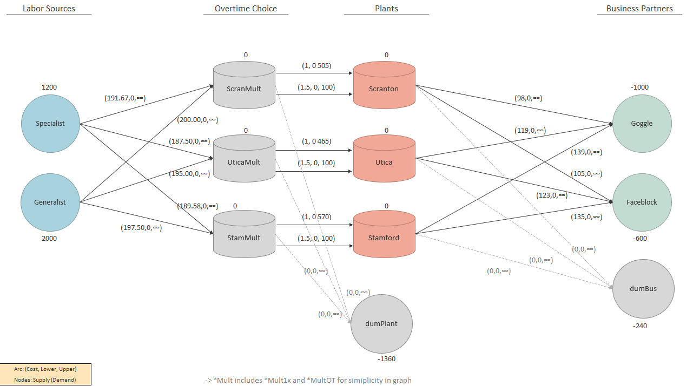

```{r setup, include=FALSE}
knitr::opts_chunk$set(echo = TRUE)
```

# - Problem `1`

<!-- ## Model Overview -->
<!--  -->

<!-- ## Mathematical Formulation -->

<!-- ### Sets -->


<!-- ### Parameters -->


<!-- ### Decision Variables -->


<!-- ### Objective Function -->


<!-- ### Constraints -->


<!-- \newpage -->

<!-- ## Code and Output -->

<!-- ### Code -->
<!--  -->


<!-- \newpage -->

<!-- ### Output -->
<!--  -->


<br>

\newpage
# - Problem `2`

<!-- ## Model Overview -->
<!--  -->

<!-- ## Mathematical Formulation -->

<!-- ### Sets -->


<!-- ### Parameters -->


<!-- ### Decision Variables -->


<!-- ### Objective Function -->


<!-- ### Constraints -->


<!-- \newpage -->

<!-- ## Code and Output -->

<!-- ### Code -->
<!--  -->


<!-- \newpage -->

<!-- ### Output -->
<!--  -->


<br>

\newpage
# - Problem `3`

## Mathematical Formulation

### Parameters

Parameter Name | Description | Unit
---------------|-------------|-------------
$NUM\_DAYS$   | Total number of days available, (e.g. 4)
$P$ | Price of *purchasing* new tires        | Dollars per Tire
$N$ | Cost of *normal* service on used tires | Dollars per Tire 
$Q$ | Cost of *quick* service on used tires  | Dollars per Tire 
$r_j$ | Demand of tires                      | Tires per day ($j \in Days$)


### Decision Variables

Variable Name  | Description
---------------|-------------
$purch_j$ | Number of tires to `purchase` on day ($j \in Days$)
$norm_j$  | Number of tires to *reshape* using the `normal` service on day ($j \in Days$)
$quick_j$ | Number of tires to *reshape* using the `quick` service on day ($j \in Days$)


### Objective Function
* Minimize total cost by when using the three types of tire services

$$
Minimize \ cost: \ \sum_{j}^{NUM\_DAYS}
(purch_j \times P) \ + \ 
(norm_j \times N) \ + \ 
(quick_j \times Q)
$$

\newpage
### Constraints

**C1**: Purchase everything on the first day
$$
purchaseDay1: purch_1 = r_1
$$

**C2**: Can't use normal service on first 2 days *(Since day 1 = purchase, then takes a day to reshape w/Normal)*
$$
normStartsAtDay2: norm_j = 0
, \ for \ j \ in \ 1, 2
$$

**C3**: Can only reshape all tires from a full 24-hour day ago *(not yesterday's tires since > 24 hrs.)*
$$
normLag: norm_j \leq purch_{j-2} + norm_{j-2} + quick_{j-2}
, \ for \ j \ in \ 3,\dots, NUM\_DAYS
$$

**C4**: Meet Daily Demand $r_j$ 
$$
dailyDemand: \ \sum_{j}^{NUM\_DAYS}[purch_j \ + \ norm_j \ + \ quick_j] = r_j
$$

**C5**: Non-Negativity Constraints
$$
r_j, purch_j, norm_j, quick_j \geq 0
$$


\newpage
## Code and Output

### Code
{ width=100% }

\newpage
### Output
* Total minimized cost total 395,200
* Interpretation of the tires purchased on each day:
  1. `320` tires purchased
  2. `240` tires reshaped with Quick Service from previous day
  3. `80` Reshaped with quick service from previous day. `320` tires used from reshaping via Normal service from day 1. 
  4. `280` Reshaped with quick service from previous day. `240` tires used from reshaping via Normal service from day 2.   

{ width=70% }


\newpage
# - Problem `4`

## Model Overview

### Network Flow Diagram
<!--  -->
{ width=100% }

\newpage
### Assumptions and Calculations for Network Flow Diagram
> Goal of below tables are to put all data on a *per unit of product* basis

{ width=100% }


\newpage
## Mathematical Formulation

### Sets, Parameters, Decision Vars
Set Name | Description 
---------|--------------
$NODES$	| Set of all nodes in above network flow diagram: Specialist, Generalist, ScranMult1x, UticaMult1x, StamMult1x, ScranMultOT, UticaMultOT, StamMultOT, dumPlant, Scranton, Utica, Stamford             
{ width=70% }


### Objective, and Constraints
{ width=70% }

\newpage

## Code and Output

### Model: `group12_HW2_p4.mod`
* Used `mcnfp.txt` from course website and renamed to `group12_HW2_p4.mod`.
* Added `data group12_HW2_p4.dat;` `solve;` and `display x;`

### Data: `group12_HW2_p4.dat`
{ width=85% }

\newpage
*Data Continued:*  
\newline
{ width=100% }

\newpage

### Output
> Shows the Objective, as well the flow from Node i to Node j for all Arcs:

* Total minimized cost: $806,192.95
* Each Column shows the source node and how much it sent to the destination node (which is shown for each row.) 
* The values show the flow from source to destination (reference flow diagram for comparison)

{ width=100% }

