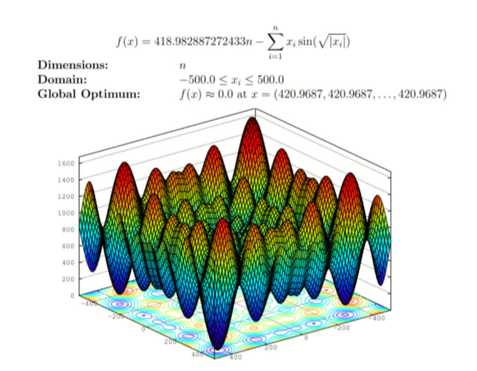

```{r setup, include=FALSE}
knitr::opts_chunk$set(
	echo = TRUE,
	include = TRUE,
	message = FALSE,
	warning = FALSE,
	tidy.opts=list(width.cutoff=60), 
	tidy  = TRUE, 
	cache = TRUE
)
```

\newpage


**Global Variables**  
  
> Input variables like the *random seed*, and the *lower and upper bound of solution space*   
> Please assume these are referenced by following code chunks

```{python globals}
import math
from random import Random
import numpy as np

# Random seed
seed = 12345
randNumGenerator = Random(seed)

# bounds for Schwefel Function search space
lowerBound = -500  
upperBound = 500   
```

\newpage


# *Question 1:* Particle Swarm Optimization
> Find the global optimium of the `Schwefel` function below

{ height=30% }


