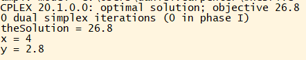
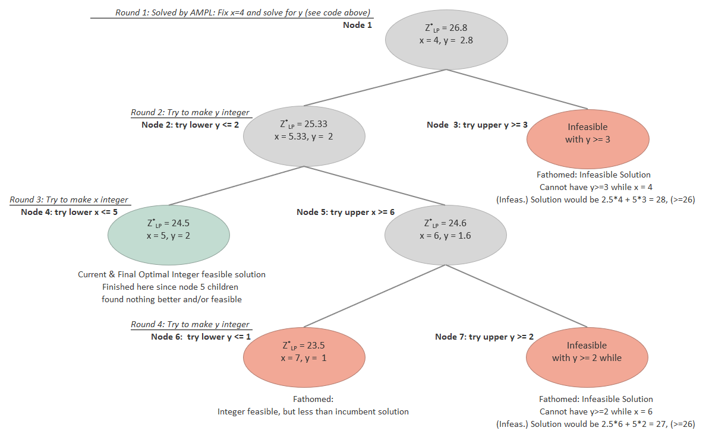
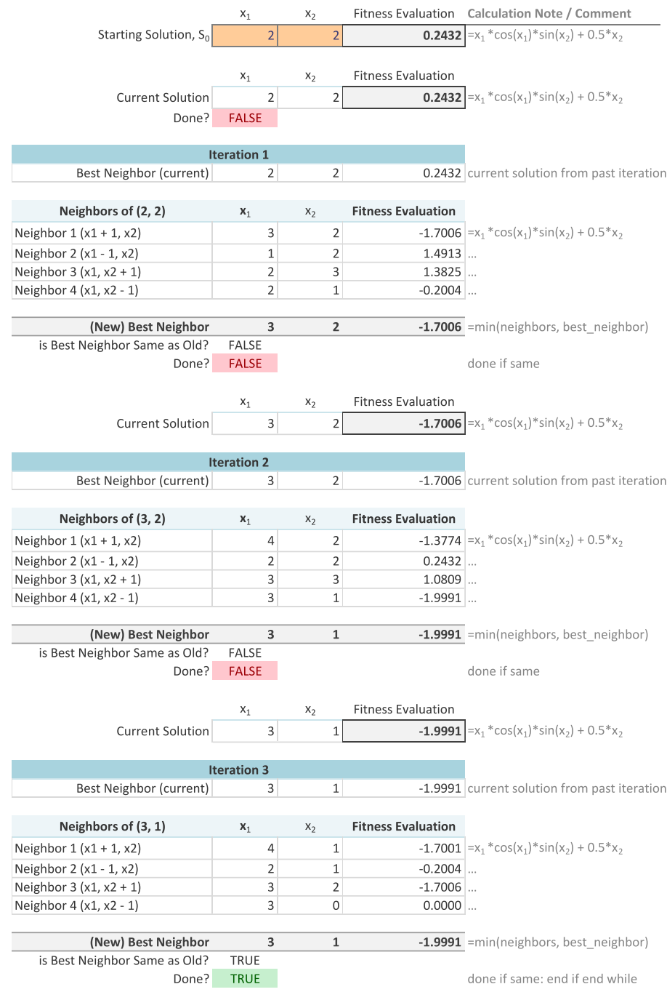
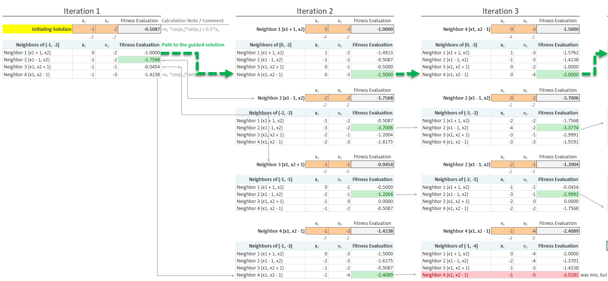
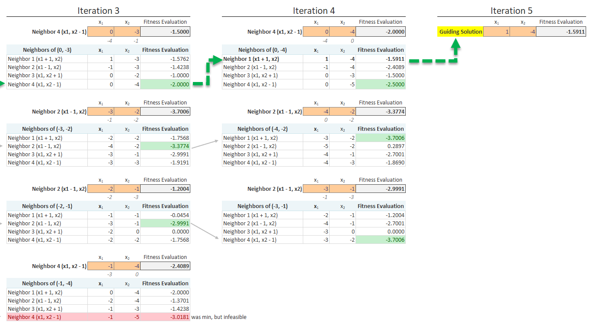
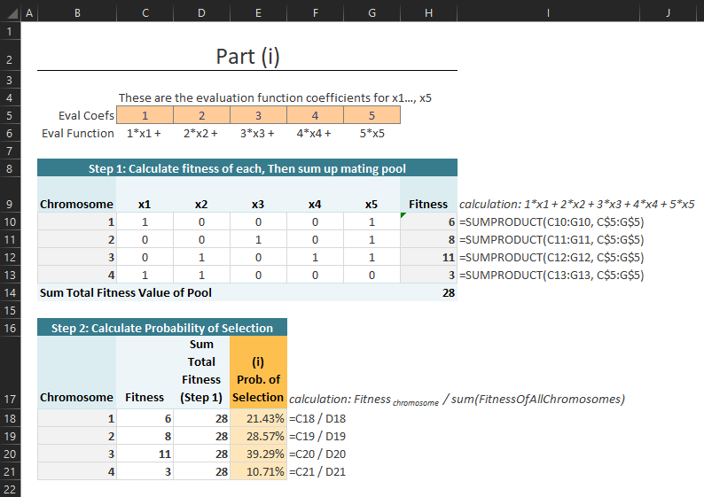
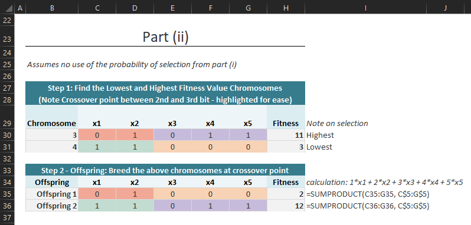
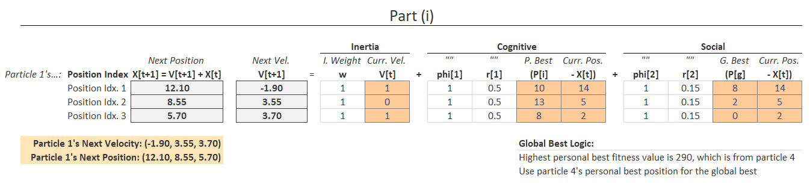
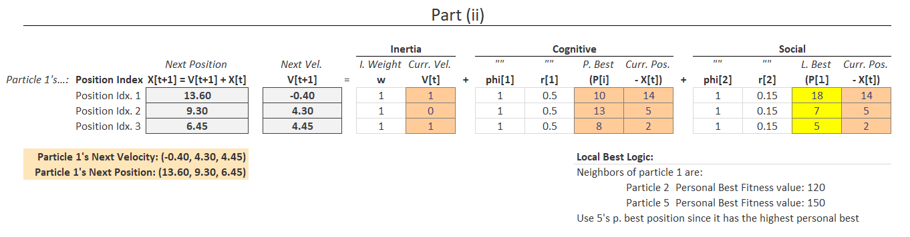

```{r setup, include=FALSE}
knitr::opts_chunk$set(echo = TRUE)
```

\newpage

# - *Question `1`* (Version 1)

## *Part 1:* Mathematical Formulation

### Sets
$NewBuildTypes$: Set of new build types $b\in (Homes, \ Duplex, \ MiniPark)$


### Parameters
Parameter | Description     | Default Value
---------:|-----------------|---------------
$budget$    | Federal grant allocation to revitalize neighborhoods | $15MM total budget 
$maxBuildingDemod$ | Max amount of buildings that can be demolished | 300 total buildings
$demoCost$  | Cost of demolishing a building | $4,000 per building
$freedUpSpace$ | Acreage generated from demolishing a building | 0.25 per building
$newBuildSpace_b$ | Amount of acreage that a new building ($b \in NewBuildTypes$) consumes | $Homes$: 0.2, $Duplex$: 0.4,  $MiniPark$: 1.0
$newBuildTax_b$ | Amount of tax dollars generated from a new building ($b \in NewBuildTypes$) | $Homes$: 1,500, $Duplex$: 2,750,  $MiniPark$: 500
$newBuildCost_b$ | Amount of dollars used to create a new building ($b \in NewBuildTypes$) | $Homes$: 150,000, $Duplex$: 190,000,  $MiniPark$: 20,000
$newBuildPercShare_b$ | Minimum required percentage share of new buildings ($b \in NewBuildTypes$) created | $Homes$: 20%, $Duplex$: 10%,  $MiniPark$: 5%


\newpage
### Decision Variables
Variable | Description 
----:|-------------
$numOldBuildsDemod$    | Number of old buildings to demolish
$numNewBuilds_b$       | Number of new buildings ($b \in NewBuildTypes$) to produce
$newBuildTotalCost$    | Variables to hold total cost of new builds ($b \in NewBuildTypes$). Calculation:  $\sum_{b\in NewBuildTypes} (numNewBuilds_b \times newBuildCost_b)$
$oldDemoTotalCost$     | Variables to hold total cost of old demolitions. Calculation: $numOldBuildsDemod \times demoCost$
$sumOfNewBuilds$       | # Variable to hold the sum of all new build types over all New build types ($b \in NewBuildTypes$). Calculation: $\sum_{b \in NewBuildTypes} (numNewBuilds_b)$


### Objective
Maximize the tax revenue from the projects
$$ maximize \ taxRevenue: \sum_{b\in NewBuildTypes} (numNewBuilds_b \times newBuildTax_b)$$


### Constraints

**C1** Spend less than or equal to the federal budget (see variable definitions)  
$$
meetTheBudget: newBuildTotalCost + oldDemoTotalCost \leq budget
$$

**C2** Can only produce new builds using the demolished buildings land
$$ 
useAvailLand: \sum_{b\in NewBuildTypes} (numNewBuilds_b \times newBuildSpace_b) 
$$
$$
\leq numOldBuildsDemod \times freedUpSpace
$$

**C3** Can only clear a certain amount of old buildings
$$
maxBuildingsCleared: numOldBuildsDemod \leq maxBuildingDemod
$$

**C4** For each new build type ($b\in NewBuildTypes$), the percentage share of the new build type must meet the minimum required (see variables)
$$
share: numNewBuilds_b \geq newBuildPercShare_b \times sumOfNewBuilds, 
$$
$$
\forall \ b \in Businesses
$$

**C5** Non-negativity and integer constraints  
$$
numOldBuildsDemod \in \mathbb{Z}, \geq 0
$$
$$
\ numNewBuilds_b \in \mathbb{Z}, \geq 0, 
\ \forall \ b \in NewBuildTypes
$$

\newpage
## *Part 2*: AMPL Code & Output

### AMPL Code

**Data $problem1.dat$**  

```{python eval=FALSE, include=TRUE}
data;

# SETS =============================================================

# Set of new build types
set NewBuildTypes := Homes Duplex MiniPark;

# PARAMETERS ========================================================

param budget           := 15000000; # federal budget 
param maxBuildingDemod := 300;      # max buildings can be demo'd
param demoCost         := 4000;     # Cost of each demolition
param freedUpSpace     := 0.25;     # Freed up space from demolition

# Amount of acreage that a new building (b in NewBuildTypes) consumes
param: newBuildSpace :=  
       Homes    0.2
       Duplex   0.4
       MiniPark 1.0
       ;
# Amount of tax dollars generated from a new building (b in NewBuildTypes)
param: newBuildTax :=  
       Homes    1500
       Duplex   2750
       MiniPark 500
       ;

# Amount of dollars used to create a new building (b in NewBuildTypes)
param: newBuildCost :=  
       Homes    150000
       Duplex   190000
       MiniPark 20000
       ;

# Minimum required percentage share of new buildings (b in NewBuildTypes) created
param: newBuildPercShare :=  
       Homes    0.20
       Duplex   0.10
       MiniPark 0.05
       ;
```

**Model $problem1.mod$**  

```{python eval=FALSE, include=TRUE}
reset;                  # Reset globals
options solver cplex;   # Using cplex for simplex alg

# SETS ============================================================
set NewBuildTypes; # Set of new build types

# PARAMETERS =======================================================
param budget           >= 0; # federal budget 
param maxBuildingDemod >= 0; # max buildings can be demo'd
param demoCost         >= 0; # Cost of each demolition
param freedUpSpace     >= 0; # Freed up space from demolition

param newBuildSpace    {NewBuildTypes} >= 0; # new build acreage
param newBuildTax      {NewBuildTypes} >= 0; # n.b. tax generation
param newBuildCost     {NewBuildTypes} >= 0; # n.b. cost
param newBuildPercShare{NewBuildTypes} >= 0; # n.b. min % share

# DECISION VARIABLES ===============================================
var numOldBuildsDemod                 >= 0 integer; # Num old builds to demo
var numNewBuilds      {NewBuildTypes} >= 0 integer; # Num new builds to create

# Variables to hold total cost of new builds over all types
var newBuildTotalCost = sum{b in NewBuildTypes} ( (numNewBuilds[b] * newBuildCost[b]));

# Variables to hold total cost of old demolitions
var oldDemoTotalCost = (numOldBuildsDemod * demoCost) ;

# Variable to hold the sum of all new build types over all New build types
var sumOfNewBuilds =  sum{b in NewBuildTypes}( numNewBuilds[b] );

# OBJECTIVE FUNCTION ===============================================
maximize taxRevenue: sum{b in NewBuildTypes}( numNewBuilds[b] * newBuildTax[b] );

# CONSTRAINTS ======================================================

# C1  Spend less than or equal to the federal budget
s.t. meetTheBudget: 
    newBuildTotalCost + oldDemoTotalCost <= budget ;

# C2 Can only produce new builds using the demolished buildings land
s.t. useAvailLand: 
    sum{b in NewBuildTypes}( numNewBuilds[b] * newBuildSpace[b] )
    <= numOldBuildsDemod * freedUpSpace ;

# C3 Can only clear a certain amount of old buildings
s.t. maxBuildingsCleared: numOldBuildsDemod <= maxBuildingDemod ;

# C4 For each new build type (b in NewBuildTypes), 
#    the percentage share of the new build type must meet the minimum required
s.t. share {b in NewBuildTypes}: 
    numNewBuilds[b] >= newBuildPercShare[b] * sumOfNewBuilds ;

# CONTROLS ==========================================================
    data problem1.dat; # retreive data file with sets/param. values
    solve;

    print;

    print "Number of old buildings to demolish and cost (dollars):";
    display numOldBuildsDemod, oldDemoTotalCost ;
    
    print "Number of new buildings produced and cost (dollars):";
    display numNewBuilds , newBuildTotalCost ;
    
    print "Total Budget Used (dollars):";
    display newBuildTotalCost + oldDemoTotalCost ;
    
    print "Part 3: Max Tax Revenue generated (dollars):";
    display taxRevenue ;
```


### *Part 2/3:* Solve AMPL Model and Display Solution
{ width=55% }


\newpage
# - *Question `2`* (Version 6)

## Code to get Root Node 
*Root Node is Node 1 in the diagram*  

### Root Node AMPL Model $problem2.mod$
```{python, eval=FALSE, include=TRUE}
reset;
option solver cplex; # Solver

var x >= 0; # Not integer because this is used to check the optimal when fixing a var
var y >= 0; # ""

# Original problem:
maximize theSolution: 2.5*x + 6*y;
	s.t. first:  3*x + 5*y <= 26;
	s.t. second:   x       >= 4;

# Used to check the BnB nodes
# Fixing x = 4 to solve for initial values of y
s.t. checkNode: x = 4;

# Solve and display
solve;
display theSolution, x,y;
```

### Output of Root Node AMPL Model (fixing x=4 & solving for y)
{ width=50% }

\newpage
## Branch and Bound Diagram  

### Summary of Diagram
* Optimal solution reached at node 4 with integer feasible values of $x = 5$, and $y = 2$
* Checked 7 total nodes
* Fathomed 3 nodes (see description of "why" in diagram)
* Each "Round" label shows which variable is being checked and for what integer value (lower or upper bound of the parent node)
  
### Branch and Bound Diagram  
{ width=100% }

\newpage
# - *Question `3`* (Version 2)

## *Part i*: Hill Climbing
* Please see the below snippet on rightmost comments about the algorithm
* Ended at iteration 3 with minimum value of -1.9991 due to no change in best neighbor
{ height=80% }

\newpage
## *Part ii*: Path Relinking
* Below shows two images with the path re-linking process iterations (from initiation to guided solution).
* Green arrow highlights the path to the guided solution
* **Logic overview:** Evaluates neighbors of initiation solution, then moves along path of each neighbor. Makes best move for each neighbor, then checks difference between current and guided solution. Repeats until finding the guided solution
* *`Iteration 3` duplicated for ease of viewing*





\newpage
## *Part iii*: Simulated Annealing
* Current `temperature = 3`

Using the evaluation function for this questions (note language below is `R`)
```{r}
# Evaluation function
evaluateFitness <- function(x1, x2) {
  x1*cos(x1)*sin(x2) + 0.5*x2
}
```


* The probability `p` of accepting a move uses the following formula: $p=e^{\frac{-\left(f\left(s_{1}\right)-f\left(s_{2}\right)\right)}{T}}$    

* Where $f\left(s_{1}\right)$ is the `current` solution, and $f\left(s_{2}\right)$ 
is the `candidate` solution since minimization. See calculation below (using evaluate function)

```{r}
# Uses the evaluation function to return the probability (see above formula)
calculateProb <- function(temperature, currentPosition, newPosition) {
  f_s1 = evaluateFitness(currentPosition[1], currentPosition[2]) # f(s[1]) current
  f_s2 = evaluateFitness(newPosition[1],     newPosition[2]    ) # f(s[2]) candidate
  
  # Probability using minimization
  p = exp(1)^( -(f_s1-f_s2) / temperature ) 
  
  return(round(p, 3))
}
```

Now calculate the probability `p` from the `current` to the `candidate` solutions  
```{r}
# What is the probability of accepting a move from 
# (4, 0) to candidate neighbor solution (4, 1)? 
paste('At temp. 3, the probability from (4, 0) to (4, 1) is', 
      calculateProb(temperature     = 3, 
                    currentPosition = c(4, 0), 
                    newPosition     = c(4, 1)) )

# What is the probability of accepting a move from 
# (4, 0) to candidate neighbor solution (4,-1)?
paste('At temp. 3, the probability from (4, 0) to (4, -1) is',
      calculateProb(temperature     = 3, 
                    currentPosition = c(4, 0), 
                    newPosition     = c(4, -1)) )
```

\newpage
# - *Question `4`* (Version 3)

## *Part (i)* - Roulette Probability
* Evaluates the fitness for each chromosome $c \in Chromosomes$ using 
$f(x) = x_1 + 2x_2 + 3x_3 + 4x_4 + 5x_5$ as evaluation function.   
* Then computes the probability based on the following equation:  $\frac{f_{c}}{\sum_{c\in Chromosomes} f_c}$  
* See yellow highlighted cells for final roulette wheel probabilities for each chromosome

{ width=60% }

## *Part (ii/iii)* - Breed Offspring
* Select the highest `(Chrom. 3)` and lowest `(Chrom. 4)` fitness valued chromosomes, then split at crossover point to produce offspring
* Offspring split between the second and third bit (highlighted for ease)
* Highest fitness valued offspring: `Offspring 2` with fitness value of `12`

{ width=60% }

<!-- ## Part (iii) -->

\newpage
# - *Question `5`* (Version 2)

## *Part (i)* - Global Best

### Assumptions
* Uses all calculations and parameter values from the problem question. See header in picture as well for the calculation
* Parameters of interest highlighted in orange
* See `global` best logic in picture below

### Solution
* Particle 1's Next `Velocity: (-1.90, 3.55, 3.70)`
* Particle 1's Next `Position: (12.10, 8.55, 5.70)`

### Relevant Work
{ width=100% }

\newpage
## *Part (ii)* - Local Best w/Ring

### Assumptions
* Local best paramaters highlighted in yellow 
* See `local` best logic with `ring` structure in picture below

### Solution
* Particle 1's Next `Velocity: (-0.40, 4.30, 4.45)`
* Particle 1's Next `Position: (13.60, 9.30, 6.45)`

### Relevant Work
{ width=100% }
