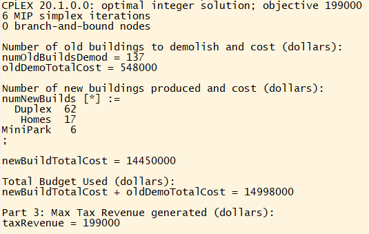

```{r setup, include=FALSE}
knitr::opts_chunk$set(echo = TRUE)
```

\newpage

# - *Question `1`* (Version 1)

## Mathematical Formulation

### Sets
$NewBuildTypes$: Set of new build types $b\in (Homes, \ Duplex, \ MiniPark)$


### Parameters
Parameter | Description | Default Value
---------:|-------------|---------------
$budget$    | Federal grant allocation to revitalize neighborhoods | $15MM total budget 
$maxBuildingDemod$ | Max amount of buildings that can be demolished | 300 total buildings
$demoCost$  | Cost of demolishing a building | $4,000 per building
$freedUpSpace$ | Acreage generated from demolishing a building | 0.25 per building
$newBuildSpace_b$ | Amount of acreage that a new building ($b \in NewBuildTypes$) consumes | $Homes$: 0.2, $Duplex$: 0.4,  $MiniPark$: 1.0
$newBuildTax_b$ | Amount of tax dollars generated from a new building ($b \in NewBuildTypes$) | $Homes$: 1,500, $Duplex$: 2,750,  $MiniPark$: 500
$newBuildCost_b$ | Amount of dollars used to create a new building ($b \in NewBuildTypes$) | $Homes$: 150,000, $Duplex$: 190,000,  $MiniPark$: 20,000
$newBuildPercShare_b$ | Minimum required percentage share of new buildings ($b \in NewBuildTypes$) created | $Homes$: 20%, $Duplex$: 10%,  $MiniPark$: 5%


\newpage
### Decision Variables
Variable               | Description 
----------------------:|-------------
$numOldBuildsDemods_b$ | Number of old buildings ($b \in NewBuildTypes$) to demolish
$numNewBuilds_b$       | Number of new buildings ($b \in NewBuildTypes$) to produce


### Objective
Maximize the tax revenue from the projects

$$ maximize \ taxRevenue: \sum_{b\in NewBuildTypes} (numNewBuilds_b \times newBuildTax_b)$$


### Constraints

**C1** Spend less than or equal to the federal budget  
$meetTheBudget:$  
$$
\sum_{b\in NewBuildTypes} \begin{bmatrix}
(numNewBuilds_b \times newBuildCost_b) + (numOldBuildsDemods_b \times demoCost)
\end{bmatrix}
\leq budget
$$

**C2** Can only produce new builds using the demolished buildings land
$$ 
useAvailLand: \sum_{b\in NewBuildTypes} numNewBuilds_b \times newBuildSpace_b 
$$
$$
\leq \sum_{b\in NewBuildTypes} (numOldBuildsDemods_b) \times freedUpSpace
$$

**C3** Can only clear a certain amount of old buildings
$$
maxBuildingsCleared: \sum_{b\in NewBuildTypes} numOldBuildsDemods_b \leq maxBuildingDemod
$$

**C4** For each new build type ($b\in NewBuildTypes$), the percentage share of the new build type must meet the minimum required
$$
numNewBuilds_b \geq newBuildPercShare_b \times \sum_{b \in Businesses} (numNewBuilds_b), 
$$
$$
\forall \ b \in Businesses
$$

**C5** Non-negativity constraints  
$$
numOldBuildsDemods_b, \ numNewBuilds_b \geq 0, 
\ \forall \ b \in NewBuildTypes
$$

\newpage
## Code

### AMPL Code
```{mod eval=FALSE, include=TRUE}
Code here
```


### AMPL Solution
{ width=80% }


\newpage
# - *Question `2`* (Version 6)

\newpage
# - *Question `3`* (Version 2)

\newpage
# - *Question `4`* (Version 3)

\newpage
# - *Question `5`* (Version 2)
